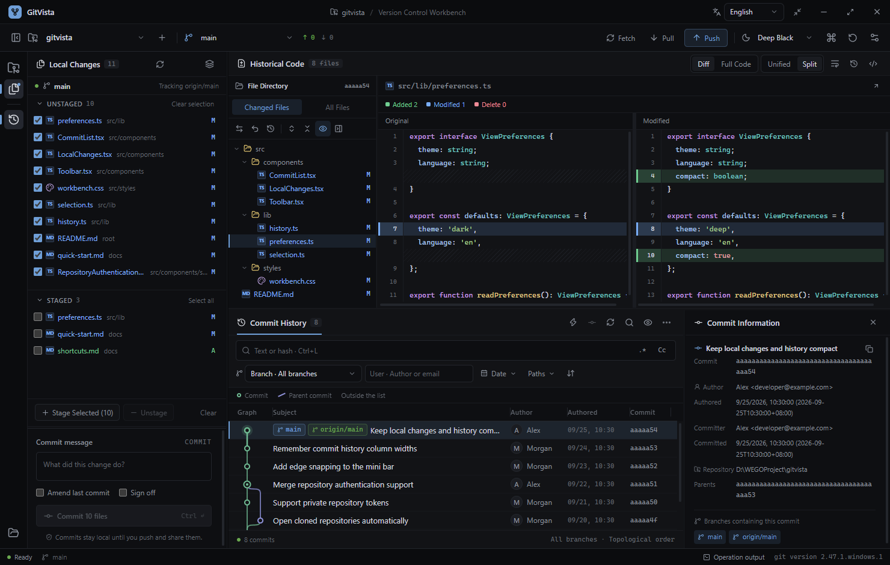
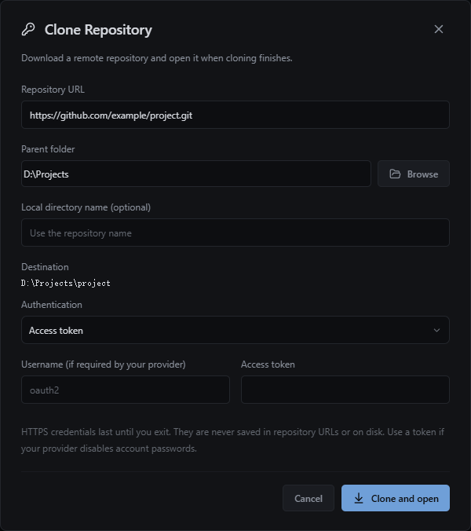
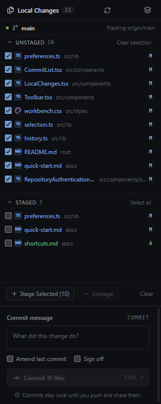
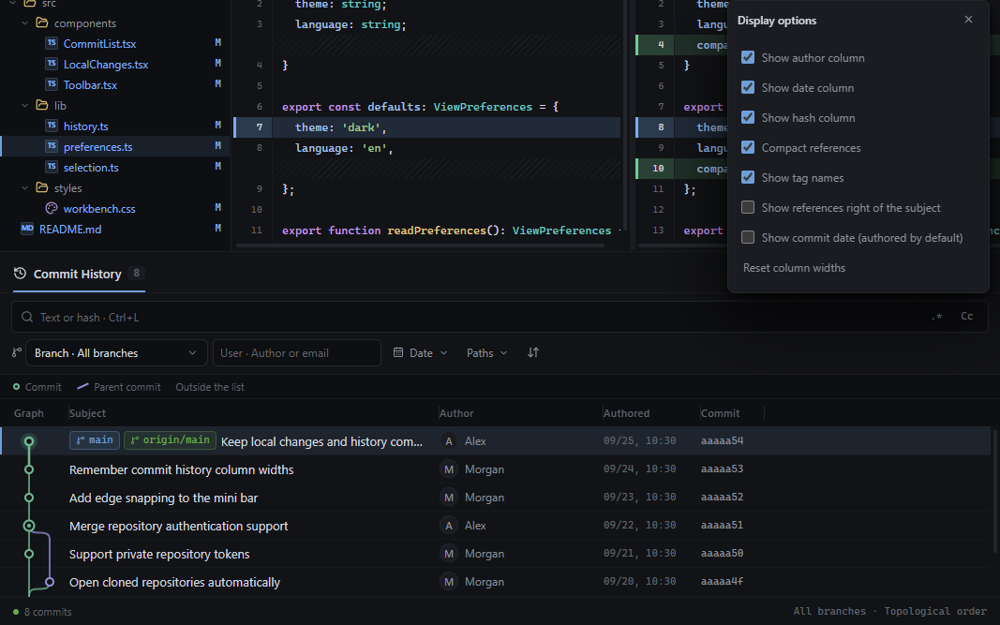
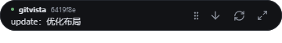
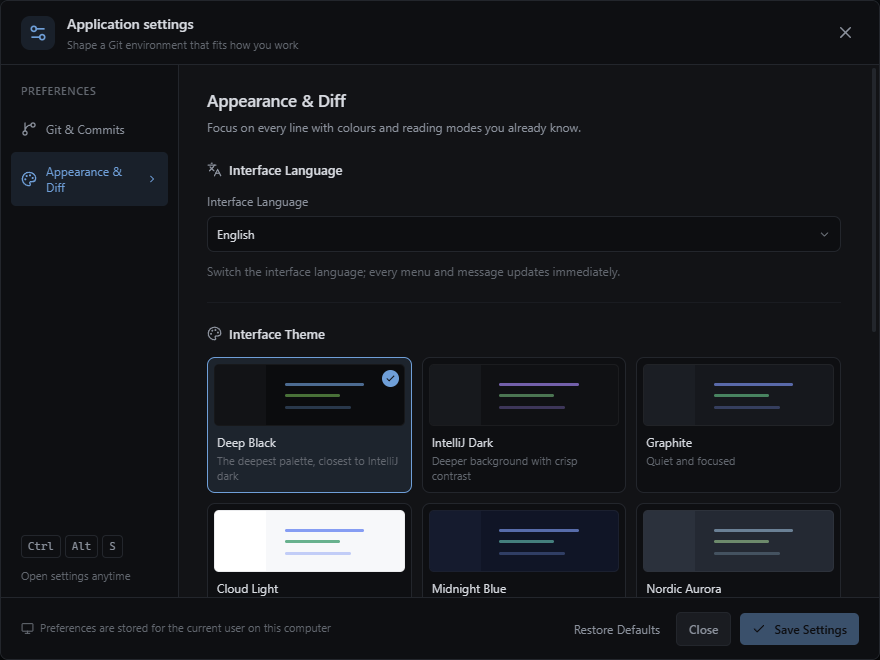

<div align="center">

# GitVista

**看清每一次变更。**

面向 Windows 的 Git 桌面客户端：在同一个工作台中检查修改、浏览历史源码、管理分支和同步远端。

内置 Git · 默认英文 / 支持中文 · 可调工作台 · 托盘与迷你横条

[功能与亮点](#功能与亮点) · [开始使用](#开始使用) · [使用说明](#使用说明) · [设置](#设置) · [开发与构建](#开发与构建) · [能力边界](#能力边界)

</div>



*新版实际界面，仓库文件、提交和作者采用内存演示数据。截图不代表本项目的实际提交，也没有为截图创建 Git 分支或提交。*

## 功能与亮点

GitVista 采用接近 IDE 的多面板布局，直接读取 Git 工作区、索引和提交对象，无需数据库或独立后端。适合希望集中查看代码变更、处理日常 Git 操作，同时保留小型桌面入口的 Windows 用户。

- **从文件到历史，联动阅读。** 点击提交即可查看改动文件、完整历史目录和源码；提交图、文件树、差异与提交信息相互联动。
- **同一屏显示更多内容。** 本地变更为 28px 单行，文件名与目录并排；提交历史为 30px 行高，关系图与记录保持对齐。文件树为 22px 行高。尺寸为逻辑像素，随 Windows 显示缩放调整。
- **空间由你分配。** 工具窗口和主要面板可拖动分隔线，历史表格各列可独立调宽并保存。列较宽时横向滚动，表头跟随列表。
- **先挑选，再执行。** 文件复选框仅用于选择；同一分区的 **Select all → Clear selection** 可反复切换，再统一暂存或提交。
- **离开主窗口也能用。** 托盘可拉取、刷新和查看最近提交；迷你胶囊悬停展开，拖到屏幕边缘磁吸，离开后带动画收起。
- **开箱即用。** Windows 包内置 MinGit；支持打开本地文件夹、指定位置克隆并自动打开，以及 HTTPS Token / 用户名密码授权。
- **照顾阅读习惯。** 默认英文，标题栏可切换中文；八套主题、统一 / 并排差异、完整源码、词法高亮、字号和自动换行。

### 功能清单

| 场景 | 当前能力 |
| --- | --- |
| 仓库 | 打开本地文件夹、初始化、克隆到指定父目录、自动打开克隆结果、最近仓库、仓库与工作树切换 |
| 本地变更 | 文件状态、逐项选择、分区全选 / 取消全选、批量暂存 / 取消暂存、提交、修订上次提交、Signed-off-by、忽略规则、丢弃已跟踪文件修改 |
| 提交历史 | 彩色分叉 / 合并图、节点与父提交跳转、文本 / 哈希 / 正则搜索、大小写匹配、分支 / 作者 / 日期 / 路径筛选、分页、引用定位、可调列宽 |
| 代码阅读 | 改动文件树、完整历史目录、历史源码、统一 / 并排差异、文件历史、逐行追溯、引用日志 |
| 分支与整合 | 创建、切换、重命名、删除、合并、普通变基、拣选、反向提交、soft / mixed / hard 重置 |
| 远端协作 | Fetch、Pull、推送预览、Push、上游设置、force-with-lease、标签推送、远端地址管理、会话内仓库授权 |
| 冲突 | 选择 ours / theirs、手动编辑、保存并标记解决、继续 / 中止 / 跳过当前操作 |
| 其他 Git 工具 | Stash、轻量 / 附注标签、引用比较、补丁导出与应用、工作树管理、子模块查看与递归更新 |
| 桌面体验 | 系统托盘、置顶迷你条、悬停展开、四边磁吸和自动隐藏、多显示器工作区适配 |

### 0.8.4 本次更新

本地变更从上下两行改为“文件名 + 目录”的紧凑单行；历史记录缩短行高，同时修正宽屏样式与关系图的高度一致性。全选按钮现在按各分区的实际选择状态切换：未全选时选中所有可选文件，已全选时清空；部分勾选、快速连续点击和冲突文件均按同一规则处理。此前的可调列宽、私有仓库授权、透明迷你条等功能保留。

## 开始使用

### 运行桌面版本

运行打包的 Windows x64 程序即可使用，目标电脑无需先安装 Git。日常使用推荐解包版本的桌面快捷方式，省去便携 EXE 每次启动展开文件的过程。

本项目提供本地安装脚本，先构建后执行：

```powershell
npm ci
npm run package:dir
powershell -ExecutionPolicy Bypass -File scripts/install-local.ps1
```

默认安装在 `D:\LenovoSoftstore\GitVista\<版本号>`，桌面创建 **GitVista <版本号> 快速启动**。脚本校验 EXE 与应用内容，保留旧版本及用户数据，不覆盖已有版本目录或快捷方式。打开新版前，在托盘菜单选择 **Quit** 退出旧版，避免单实例机制切回旧窗口。

### 打开或克隆仓库

左上角仓库下拉菜单提供这些入口：

| 入口 | 操作 |
| --- | --- |
| **Open local folder…** | 选择本地文件夹；普通目录会询问是否初始化为 Git 仓库后打开 |
| **Clone from Git…** | 填写远端地址、父文件夹和可选目录名，点击 **Clone and open** 后自动打开结果 |
| **Repository credentials** | 为当前仓库选择远端并设置本次运行使用的授权 |
| 最近仓库 | 搜索名称或路径，切换已打开的项目 |



*克隆窗口使用示例 URL 和目录，未输入令牌，也未执行克隆。*

HTTPS 私有仓库可选 **Access token** 或 **Username and password**。用户名按服务商要求填写；服务商禁用账户密码时使用 Token。授权只在本次应用运行期间保留，不写入 URL、Git 配置或应用设置，退出后需要重新输入。选择系统凭据选项可清除本次运行的仓库授权。

已有的 SSH 密钥、SSH agent 和 Git 凭据管理器仍可使用。应用不提供服务商 OAuth 网页登录；SSH 私钥口令和凭据助手的交互由现有系统配置处理。**Git 提交用户名 / 邮箱与远端登录凭据是不同的设置。**

## 使用说明

### 1. 检查、选择与提交本地修改

点击最左侧 **Local Changes** 图标打开变更面板。**Unstaged** 与 **Staged** 分别显示未暂存和已暂存文件，点击文件名查看差异，悬停查看完整路径。



| 操作 | 结果 |
| --- | --- |
| 勾选单个文件 | 选择该文件，不改变 Git 索引或源码 |
| **Select all** | 选中当前分区的全部可选文件；部分勾选时补齐全选 |
| **Clear selection** | 再点同一位置，取消该分区全部勾选，另一分区保持原样 |
| **Stage Selected** | 将勾选的未暂存文件加入索引 |
| **Unstage Selected** | 将勾选的已暂存文件移出索引 |
| 操作栏 **Clear** | 清空两个分区的勾选，不改动文件 |

全选跳过不可勾选的冲突文件；空分区按钮禁用。同一路径同时出现在两个分区时，各自独立选择。暂存 / 取消暂存后会清空对应选择并刷新状态。

填写提交说明后点击 **Commit**，或按 `Ctrl + Enter`。有勾选时只提交所选文件；**没有勾选时，提交范围回退为整个暂存区**，取消勾选不等于取消暂存。可开启 **Amend last commit** 修订上次提交，或添加 Signed-off-by。

### 2. 浏览提交、源码和分支关系

下方 **Commit History** 显示历史记录；点击某行或图中的节点，上方更新改动目录和代码，右侧可展开 **Commit Information**。

- **Changed Files / All Files**：查看该次提交的改动，或该版本的完整目录。前者默认展开，后者默认折叠；支持逐级、全部展开 / 收起。
- **Diff / Full Code**：在差异与完整历史源码间切换。删除文件可查看父提交中的版本。
- **Unified / Split**：统一或并排差异。代码区隐藏 Git 补丁头和块范围，保留源码、行号及新增 / 修改 / 删除颜色。
- 提交图实线连接真实父提交，双圈为合并提交。点击实线跳转父提交；短虚线表示父提交不在当前结果中，点击后定位并加载它的历史。
- 节点和连线支持悬停提示、Tab 聚焦、Enter / 空格激活，以及右键日志操作。

### 3. 调整列宽、筛选与定位

拖动 **Graph、Subject、Author、Authored / Committed、Commit** 表头右侧的分隔线即可调整列宽，结果自动保存在本机。双击恢复单列默认；聚焦后方向键微调，Shift 加大步长。显示选项中的 **Reset column widths** 一次恢复全部列宽。



表格超过可用宽度时横向滚动，表头与记录同步。显示选项还可控制作者 / 日期 / 哈希列、紧凑引用、标签、引用位置和创作 / 提交时间。

文本、分支、作者、日期和路径可组合筛选；查询作用于 Git 历史，不局限于已经加载的记录。正则使用 Git 扩展正则（ERE），例如 `[0-9]+`。日期筛选按提交者日期解释，含起止当天并遵循本机时区；日期列的显示方式不改变筛选依据。路径需使用仓库内的相对路径。

输入哈希、分支或标签可定位尚未加载的提交。定位会清除当前筛选，展示目标及其之前的历史；仅浏览，不检出分支。日志每页默认 250 条，可继续加载。排序可选拓扑 / 日期，也可仅显示第一父提交或排除合并提交。

### 4. 获取、拉取与推送

**Fetch** 更新远端引用；**Pull** 按设置的策略整合远端，默认 `ff-only`，无法快进时停止并提示。设置中可改为合并或变基。

点击 **Push** 先显示待推送提交和暂存区文件，可逐个查看差异。**如果暂存区有文件，直接推送会先按填写的提交说明提交整个暂存区，再推送**，请在预览中核对范围。推送失败不撤销已经完成的本地提交。

分支、标签、Stash、冲突、补丁等操作集中在顶部 **Git toolbox**。丢弃、重置、删除和强制推送等操作会展示相应确认。仅撤销某次提交中的某个文件时，可在历史文件工具栏执行反向撤销；结果留在工作区，检查后自行暂存与提交。

### 5. 托盘与迷你横条

最小化或关闭主窗口会收起到 Windows 右下角托盘。右键托盘可恢复窗口、进入迷你模式、拉取、刷新、查看最近 5 条提交或 **Quit** 退出。

标题栏的 **Mini bar** 打开 128×40 的置顶胶囊，保留拉取、刷新与恢复主窗口按钮；悬停平滑展开为 360×40，显示仓库和最新提交，移开后恢复胶囊。



*此图为本机 GitVista 仓库的真实最新提交摘要；迷你条使用独立透明窗口，圆角外侧可穿透鼠标。*

拖动左侧把手或提交文字，距离屏幕工作区边缘 28 个逻辑像素内松手会磁吸贴边。鼠标离开约半秒后，横条带动画收进边缘，只留 6 像素把手；悬停或点击弹出，拖离边缘取消贴边。支持四边和多显示器，显示器配置变化时移回可见区域。

刷新读取本地历史，拉取才访问远端；后台每 30 秒更新本地摘要。恢复主窗口时保留原有尺寸、最大化状态和工作内容。

### 常用快捷键与布局

| 操作 | 快捷键 / 方法 |
| --- | --- |
| 打开仓库 | `Ctrl + O` |
| 刷新工作区 | `Ctrl + R` |
| 提交 | `Ctrl + Enter` |
| 日志文本搜索 | `Ctrl + L` |
| 定位提交、分支、标签 | `Ctrl + F` |
| 应用设置 | `Ctrl + Alt + S` |
| 调整面板 / 列宽 | 拖动分隔线；双击或 Home 恢复；方向键微调 |
| 菜单选择 | 上下方向键、Enter 确认、Escape 关闭 |

左侧三个工具窗口可各自开关；主要面板边界支持拖动，尺寸保存在本机。顶部恢复布局入口可还原面板尺寸；历史列宽通过日志显示选项单独重置。

## 设置

标题栏右侧 **English / 中文** 下拉框可直接切换语言，默认英文；仓库名称、提交说明和源码保持原文。也可在 **Application settings → Appearance & Diff → Interface Language** 中设置。



| 类别 | 设置项 |
| --- | --- |
| Git 与提交 | Git 路径及测试、当前仓库 / 全局提交身份、默认拉取策略 |
| 外观与差异 | 英文 / 中文、八套主题、统一 / 并排差异、10–22px 代码字号、自动换行 |

主题包含深黑、IDEA 深黑、石墨深色、云白浅色、午夜蓝、北欧极光、森林绿和暮光玫瑰。界面偏好保存在本机，不修改项目文件；设置中的修改需点击保存应用设置。恢复默认先填写默认值，保存后生效。

Git 路径为 `git` 时，打包版优先使用内置 MinGit，源码开发版优先系统 Git；也可指定 `git.exe` 完整路径。提交身份的姓名 / 邮箱通过单独按钮保存到当前仓库或全局 Git 配置；仓库设置通常覆盖全局，清空仓库字段可恢复继承。全局身份会影响其他仓库，修改不会改写已有提交。

## 开发与构建

技术栈为 **Electron + React + TypeScript + Vite**，esbuild 构建主进程与预加载脚本，electron-builder 打包 Windows x64 应用。开发环境使用 Node.js 24 和 npm。

```powershell
git clone https://github.com/sssjack/gitvista.git
cd gitvista
npm ci
npm run dev
```

开发服务器仅监听 `127.0.0.1:5179`，启动脚本同时打开 Electron。修改主进程或预加载脚本后需重新构建并重启。

| 命令 | 用途 |
| --- | --- |
| `npm run dev` | 启动开发环境 |
| `npm run typecheck` | TypeScript 类型检查 |
| `npm run build` | 检查类型，构建前端、主进程与预加载脚本 |
| `npm run start` | 运行已构建的应用 |
| `npm run fetch:mingit` | 下载并解包内置 Git，已有对应版本时跳过 |
| `npm run package:dir` | 生成 `release/win-unpacked/` 可直接运行的应用 |
| `npm run package` | 生成 `release/GitVista-<版本号>-Windows-x64.exe` 便携包 |
| `powershell -ExecutionPolicy Bypass -File scripts/install-local.ps1` | 安装已解包应用并创建桌面快捷方式 |

打包命令通过预处理钩子从 git-for-windows 官方发布获取 MinGit 2.47.1，放到 `vendor/mingit` 并随应用打包至 `resources/git`。`vendor/` 不随源码提交。可用 `node scripts/fetch-mingit.mjs --force` 重新获取，或通过 `GITVISTA_MINGIT_URL` 指向本地压缩包 / 镜像地址。下载失败时可能得到不含 Git 的包，发布前应确认打包日志与实际内容。

### 代码组织

| 位置 | 职责 |
| --- | --- |
| `electron/main.ts`、`preload.ts` | 主窗口、受限 IPC、权限与应用设置 |
| `electron/desktop-companion.ts`、`mini-preload.ts` | 托盘、迷你条几何动画和独立最小接口 |
| `electron/git-service.ts`、`git-runtime.ts`、`git-credentials.ts` | Git 操作与校验、程序解析、会话内远端授权 |
| `shared/types.ts`、`messages.ts`、`additional-messages.ts` | 跨进程类型、中英文案 |
| `src/App.tsx`、`src/components/` | 工作台、仓库对话框、历史、差异、设置与迷你条 |
| `src/lib/commit-graph.ts`、`log-columns.ts`、`panel-preferences.ts` | 提交图布局、列宽和面板偏好 |
| `src/styles.css`、`workbench-layout.css` | 主题、基础样式与工作台布局 |
| `docs/images/` | 实际界面截图与文档配图 |

界面通过预加载 API 调用主进程校验后执行 Git。新增操作应沿用这条路径；文案用中文原文作键，通过 `t(...)` 与共享词典翻译，避免默认英文界面混入未登记的中文提示。

### 验证

```powershell
npm run typecheck
npm run build
git diff --check
```

本地验证覆盖 Git 解析与参数校验、只读查询、面板交互、列宽、主题、透明迷你条和打包启动；0.8.4 增加紧凑行高、宽 / 窄窗口关系图对齐，以及分区全选、取消全选、部分选择、冲突排除和快速连续点击检查。界面演示使用内存数据，测试前后比对真实仓库元数据，确保浏览和勾选没有修改 Git。

**测试仅保留在本地。** `tests/`、`.local/` 及测试生成文件已由 `.gitignore` 排除，不随源码提交或发布。公开源码可复现类型检查与构建；不附带完整本地自动化套件。远端网络、凭据助手、用户钩子和真实推送结果取决于使用环境。

## 能力边界

- 发布与验证目标为 Windows x64，尚无 macOS / Linux 发布包。
- 文件级选择与暂存已支持，尚无按行 / 按块暂存、Changelists、Shelf 或 IDE Local History。
- 提供普通变基与冲突文本编辑，尚无可拖拽的交互式变基或完整三方合并编辑器。
- 未集成托管平台 PR / MR、CI 状态或 GPG 签名验证；不是完整 IDE，不含语言服务器、调试或项目构建系统。
- 源码为轻量词法高亮；完整历史源码只读，实际编辑入口在冲突工具。
- 日志默认每页 250 条、单页最多 500 条；文件历史和引用日志最多单次 500 条。历史目录最多 50,000 条目；文本读取上限 4 MB，过大差异会截断并提示。
- 二进制或无效 UTF-8 内容不作为普通文本编辑；保留文件管理器入口。历史对象缺失时显示 Git 原始错误，不自动重置或下载仓库对象。
- 内置 MinGit 2.47.1 不包含 Git Bash、Perl 扩展或图形工具。特殊 Git 环境可指定本机完整 Git。

## 安全与数据

渲染进程启用沙箱和上下文隔离，关闭 Node 集成；主进程检查调用来源、仓库路径、引用和操作参数。迷你窗口只暴露桌面伴随接口。Git 使用参数数组执行，文件访问限制越界及 `.git` 元数据写入，并对文本和输出设置大小上限。

同一仓库的 Git 写操作串行处理，只读查询关闭可选索引刷新锁；强制推送使用 `--force-with-lease`。Token / 密码只保留于本次运行的内存，远端 URL 展示隐藏凭据。系统凭据助手和 SSH 仍遵循本机配置；Git 子进程、用户钩子不因此运行在隔离容器中。

## 许可证

项目在 `package.json` 中标记为 `UNLICENSED`，未授予 MIT、Apache 等开源许可证。第三方依赖遵循各自许可证。
