<div align="center">

# GitVista

**看清每一次变更。**

面向 Windows 的 Git 桌面客户端，把仓库、分支、提交历史、完整源码和代码差异放进同一个工作台。
内置 Git，装上即可使用；界面支持中英文切换，默认英文。

[功能](#功能概览) · [开始使用](#开始使用) · [设置](#设置) · [开发](#开发与构建) · [能力边界](#与-idea-的功能对应)

</div>

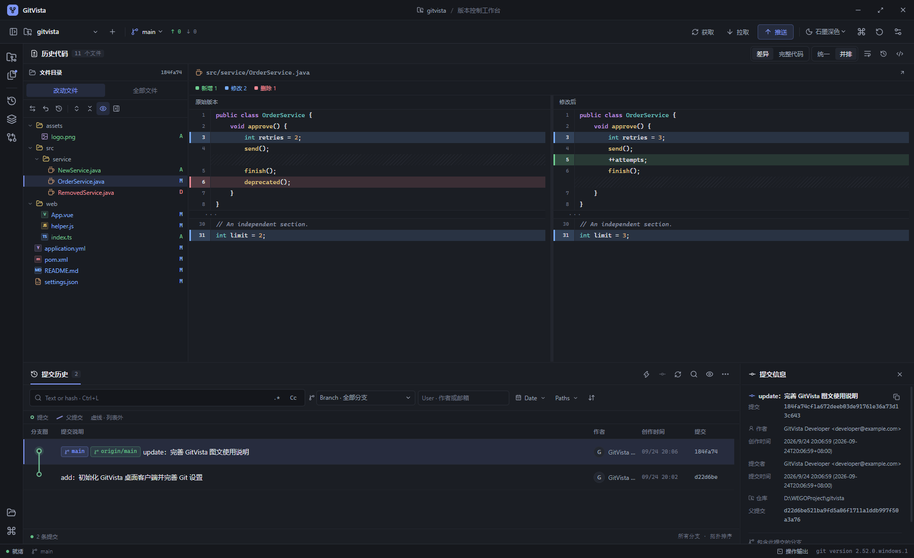

GitVista 采用接近 IDEA 的多面板操作方式，读取真实的工作区、索引和提交对象。既可以处理日常提交与分支操作，也可以在某次历史提交的完整目录中浏览源码。无需数据库或独立后端服务。

**自带 Git，无需先安装。** 打包版本内置 MinGit，新电脑上装好 GitVista 就能克隆、提交和推送；如果本机已经装了 Git，也可以继续使用它。

## 功能概览

| 场景 | 支持的操作 |
| --- | --- |
| 仓库管理 | 打开、克隆、初始化、最近仓库、多仓库切换、工作树切换 |
| 本地变更 | 查看状态、**先选中再统一暂存或提交**、批量暂存与取消暂存、刷新工作区、提交、修订上一条提交、Signed-off-by、忽略规则、丢弃已跟踪文件的修改 |
| 提交历史 | 可点击的连续彩色分叉 / 合并图、父提交跳转、文本 / 哈希 / 正则搜索、大小写匹配、分支 / 作者 / 日期 / 路径筛选、分页加载、引用定位、提交详情、改动文件树、完整历史目录树、文件历史、逐行追溯、引用日志 |
| 代码阅读 | 统一与并排差异、完整历史源码、行号、八主题词法高亮（类、方法、注解等）、字号和自动换行 |
| 分支操作 | 创建、切换、重命名、删除、合并、普通变基、拣选、反向提交、soft / mixed / hard 重置 |
| 远端协作 | 获取、拉取、**推送前预览待推送提交与暂存区文件**、设置上游、force-with-lease、标签推送、远端地址管理 |
| 储藏与标签 | 保存、应用、弹出和删除 Stash；创建轻量或附注标签、删除本地标签 |
| 冲突处理 | 标记冲突、选择 ours / theirs、编辑冲突文件、保存并标记解决、继续 / 中止 / 跳过操作 |
| 进阶工具 | 比较引用、导出和应用补丁、工作树管理、查看及递归更新子模块 |
| 应用设置 | 内置或指定 Git 可执行文件、提交身份、默认拉取策略、**界面语言**、主题、差异视图、代码字号、自动换行 |

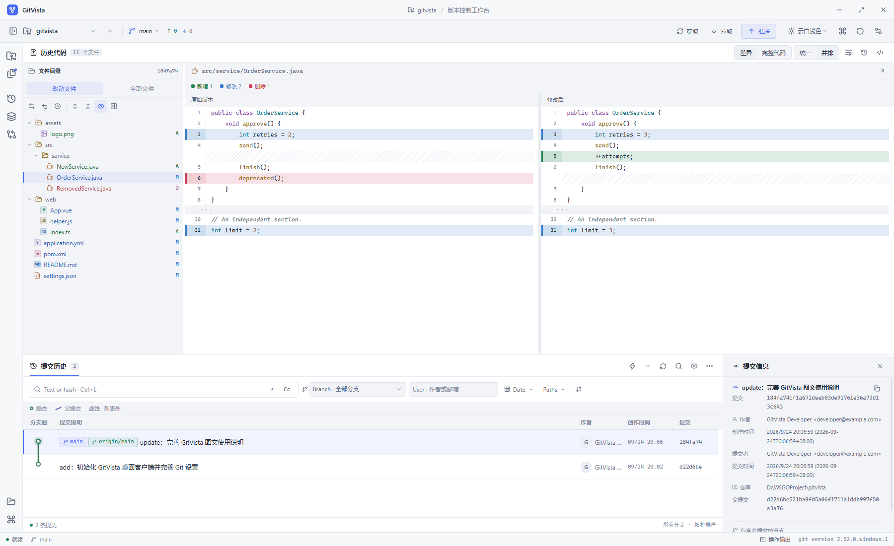

### 一个工作台完成日常操作

1. **打开仓库**：选择已有 Git 仓库，或通过克隆、初始化创建工作区。
2. **检查修改**：点击左侧图标栏的“本地变更”展开工具窗口，区分未暂存和已暂存文件；点击文件名在上方查看差异。
3. **选中并提交**：勾选要处理的文件——**勾选只表示选中，不会改动索引**；确认无误后在操作栏点“暂存选中”，再填写提交说明提交。提交时只会提交选中的文件。
4. **推送**：点击顶部“推送”先打开推送预览，核对将要推送的提交与暂存区文件；可以直接推送（暂存区内容会一并提交），也可以先点开某个文件检查改动。
5. **浏览历史**：点击图标栏的“提交历史”展开面板，左侧文件目录切换“改动文件”或“全部文件”，上方选择“差异”或“完整代码”；下方右侧显示提交信息。

侧栏、历史面板、文件目录与本地变更面板支持拖动分隔线调整空间。左侧图标栏的三个按钮分别开关“仓库与分支”“本地变更”“提交历史”工具窗口，再次点击即收回。完整代码视图读取所选提交的内容；对删除文件，可查看父提交中的版本。

### 自带 Git 与中英切换（0.7.0）

- **内置 Git**：打包版本随应用附带 MinGit 2.47.1，目标电脑不需要预装 Git。设置页的“内置 Git”说明了这一点；把“Git 路径”留作 `git` 时优先使用内置版本，也可以改成 `git.exe` 的完整路径改用本机已安装的 Git。
- **开发态优先系统 Git**：源码运行时优先使用系统 Git，避免内置版本掩盖本机环境；打包后才切换为内置优先。
- **中英切换**：设置 → 外观与差异 → 界面语言可在中文与英文之间切换，保存后立即生效并记住选择，**默认英文**。菜单、日志面板、对话框和错误信息都会一起切换。
- **最深的一套配色**：新增“深黑”主题，底色比“IDEA 深黑”更深，接近 IDEA 深色编辑器的观感。


### 目录默认状态与主题菜单（0.6.3）

- **全部文件默认折叠**：切换后先显示顶层目录，需要时逐级展开。
- **改动文件默认展开**：直接展示当前提交涉及的文件；切换提交或仓库时恢复对应默认状态。点击文件与刷新内容保留手动调整。
- **统一弹出菜单**：仓库、分支、主题、日志筛选和设置选项使用与应用主题一致的菜单，包含选中标记、悬停效果和键盘操作。仓库菜单显示路径，仓库与分支支持搜索，主题菜单提供配色预览。
- **键盘选择**：上下方向键移动高亮，Enter 确认，Escape 取消；浏览选项不会立即切换分支。

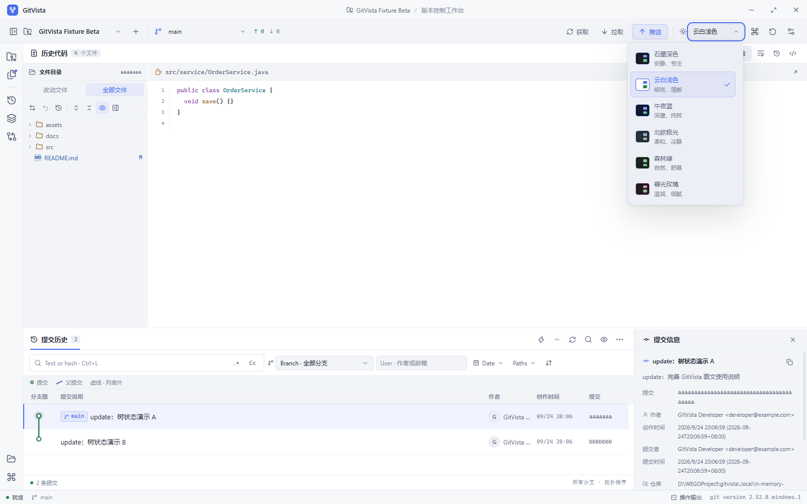

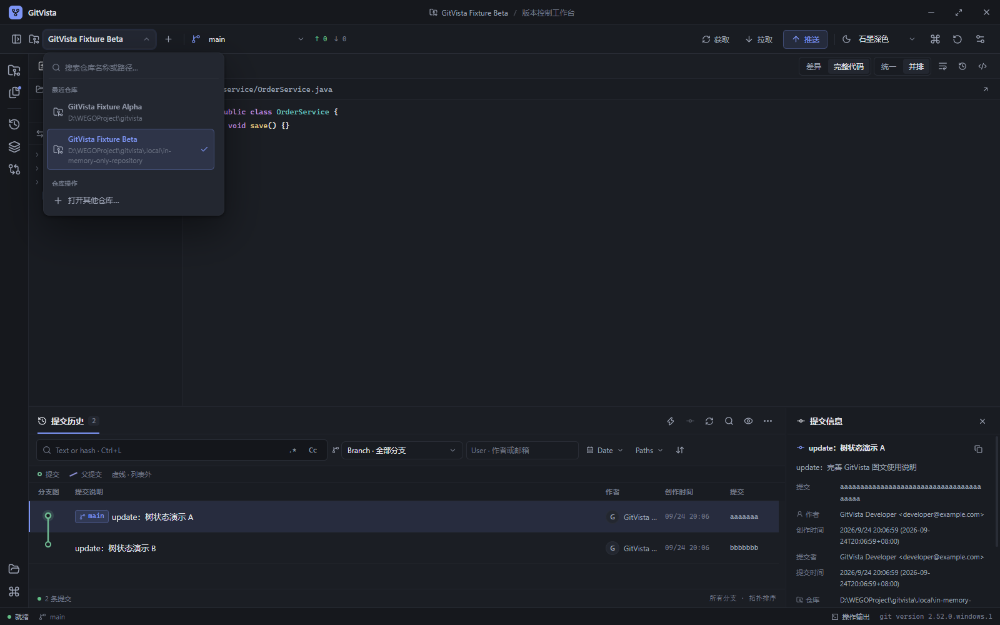

### 紧凑目录与清晰差异（0.6.2）

- **纯代码差异**：代码区域只显示源码及行号，隐藏 Git 的文件头、对象索引、块范围和补丁前缀；源码本身的加减运算符照常保留。
- **明显的变更颜色**：新增绿色、修改蓝色、删除红色。文件名和状态标记使用对应颜色，代码差异使用背景与行号栏色带；所有主题均适配。
- **紧凑文件树**：目录和文件行高为 22px，同样空间可显示更多行；0.6.3 起“全部文件”默认折叠、“改动文件”默认展开，仍可手动逐级调整。
- **文件类型图标**：Java、JavaScript、TypeScript、Vue、XML / Maven、JSON、YAML、Markdown、图片等使用不同的图标或徽标。类型按文件名和扩展名判断。
- **完整目录状态**：“全部文件”也标出当前提交的新增与修改文件；当前版本中已删除的文件在“改动文件”查看。

本页新版截图使用隔离的目录与代码演示数据，不修改实际 Git 仓库。

### 逐级文件目录（0.6.1）

“改动文件”“全部文件”和工作区文件统一按文件夹逐级显示：点击箭头展开或收起目录，文件行只显示文件名。支持展开全部、折叠全部与深目录横向滚动；悬停仍可查看完整路径。旧版本保存的“完整路径平铺”设置会自动清除，升级后无需手动切换。

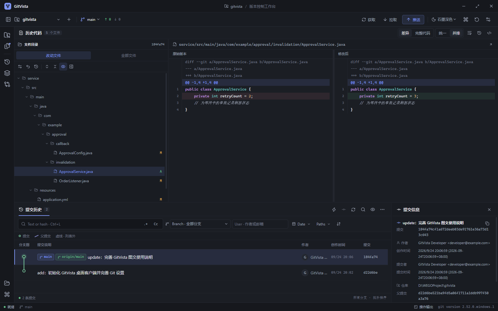

截图中的目录和代码使用隔离的界面演示数据，未修改真实仓库。

### 更聚焦的布局与更少等待（0.6.0）

| 位置 | 内容 |
| --- | --- |
| 上方左侧 | 当前提交的改动目录 / 完整目录，或工作区改动文件 |
| 上方主区域 | 完整代码、统一差异或并排差异 |
| 下方左侧 | 连续分叉图、提交历史与筛选工具 |
| 下方右侧 | 所选提交的说明、哈希、作者、时间、父提交和所属分支 |
| 最左侧收缩栏 | 点击“仓库与分支”或“本地变更”展开对应工具窗口，再点一次收起；提交输入位于本地变更窗口 |

主要边界支持拖拽：左侧工具窗口、文件目录与代码、代码与历史、历史与提交信息、左右差异、未暂存与已暂存、变更列表与提交输入。尺寸和工具窗口选择保存在本机，小窗口自动限制宽度。双击分隔线或按 Home 恢复单处尺寸；方向键微调，Shift 加大步长；顶部“恢复默认面板布局”恢复布局并收起工具窗口。

- **启动和日志**：首屏复用已经读到的历史，不再重复查询日志；作者候选在使用筛选时读取。分支与日期筛选立即查询，文本输入短暂防抖。
- **选择文件**：同一提交内切换文件，不再重复读取提交详情；只请求当前需要的代码或差异。
- **暂存反馈**：立即显示进度，操作完成后仅刷新实际文件状态及相关工作区内容。查看历史时暂存不会重载历史代码，失败按实际 Git 状态反馈。
- **Git 进程**：合并仓库校验与远程信息读取，缓存 Git 版本。更换 Git 程序会重新验证；修改主题和字号不会重复检测 Git。
- **长行阅读**：左右差异分别横向滚动，纵向同步；相邻增删块对齐，可直接开启自动换行。
- **代码颜色**：每套主题分别定义类 / 类型、方法 / 函数、注解、属性、常量、关键字、字符串、注释和数字颜色。完整代码与差异共用词法规则，多行注释与字符串保持状态；较长内容简化部分高亮但保留原文。这是轻量词法高亮，不是 IDEA 的项目级语义分析。

本节截图的代码和文件状态使用内存演示数据，真实仓库未被修改。其余旧版本功能截图的面板位置可能不同，操作功能保留。实际速度依文件体积、仓库规模和磁盘而定；不会提前显示未经 Git 确认的暂存成功状态。

### 桌面快速启动

便携 EXE 在启动时需要展开运行文件。日常使用可构建一次解包版本并创建快捷方式，之后直接运行：

```powershell
npm run package:dir
powershell -ExecutionPolicy Bypass -File scripts/install-local.ps1
```

默认放到 `D:\LenovoSoftstore\GitVista\<版本号>`，在桌面创建“GitVista <版本号> 快速启动”快捷方式。脚本保留旧版本，不覆盖已有版本目录或快捷方式，校验 EXE 和应用内容后才建立入口；不修改 Git 仓库。配置继续使用原来的本机应用数据目录。打开新版前请退出正在运行的旧版，避免单实例机制切回旧窗口。

遇到 `unable to read tree` 等历史对象错误，应用会保留 Git 原始错误并说明受影响内容；不会自动修复、重置或下载仓库对象。当前工作区文件仍可从“本地变更”查看。

### 可点击的分叉与合并图

从 **0.4.0** 开始，提交历史使用连续的彩色轨道显示真实父子关系；分叉和合并保持连贯，双圈节点表示含多个父提交的合并提交。图宽随分支数量扩展，复杂历史可以横向滚动查看，表头保持同步。

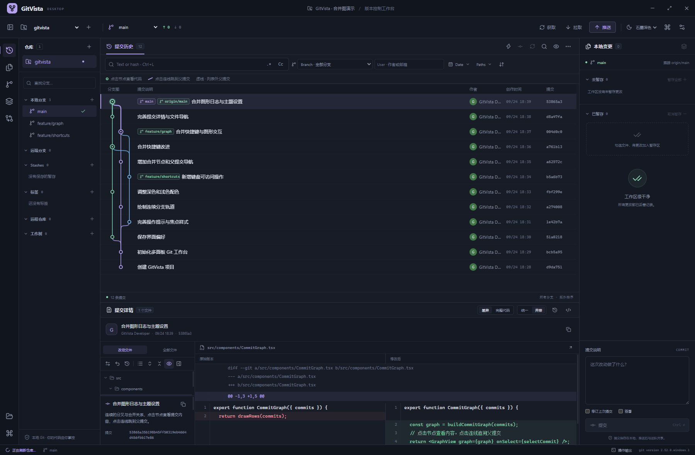

上图及下图使用内存中的虚拟合并历史展示多分支关系，不对应项目实际提交，也不会创建演示分支或提交。

| 操作 | 结果 |
| --- | --- |
| 点击提交节点 | 选中该提交，上方显示目录与代码，下方右侧显示提交信息 |
| 点击实线 | 跳到这条线指向的父提交，保留当前筛选并滚动到对应记录 |
| 悬停节点或连线 | 高亮相关关系；提示显示子提交、父提交及点击行为 |
| 点击短虚线 | 父提交不在当前结果中；解析其引用，清除筛选并显示该提交及其历史 |
| Tab 聚焦后按 Enter / 空格 | 激活当前节点或连线，完成相同的选择或跳转 |
| 右键节点或连线 | 选择对应提交并打开日志操作菜单 |

合并提交的每个父提交都有独立连线；“仅第一父提交”模式只显示第一父关系。日期排序出现父提交位于上方时，用额外轨道回连。未加载或被过滤的父提交显示短虚线，不把无关记录误连在一起；无过滤分页追加时保留已有节点的轨道和颜色。

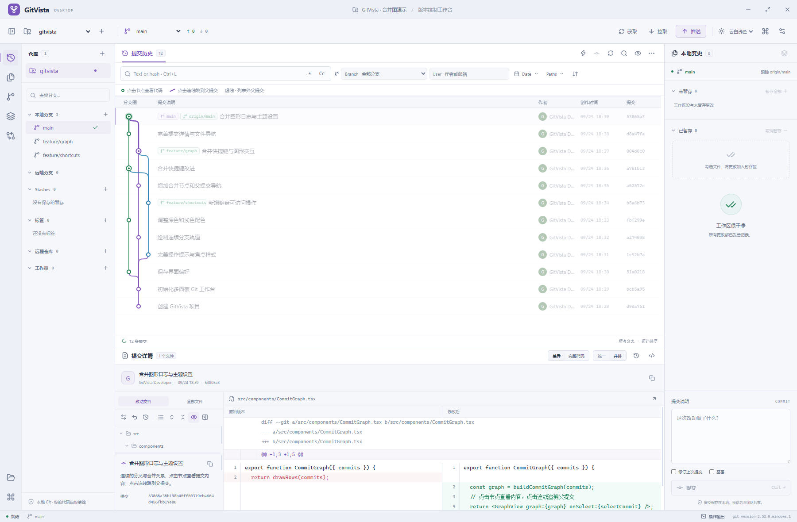

所有主题均支持提交图，浅色主题使用较深的线条颜色，便于辨认。选中与跳转仅用于浏览历史，不会切换当前工作分支。

### 截图中的 IDEA Log 功能核对

下表对应 IDEA 截图红框中的日志工具栏、改动文件工具栏和提交详情，功能名称参考 [JetBrains Log tab 文档](https://www.jetbrains.com/help/idea/log-tab.html)。它不代表已实现 IDEA 所有右键菜单、插件或 IDE 内部服务。

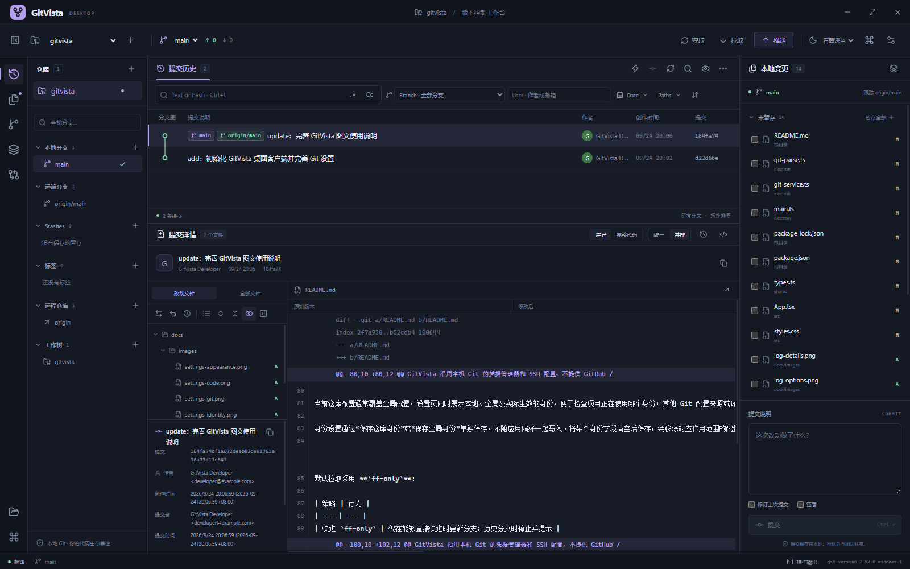

日志截图中的作者与邮箱使用演示身份；截图过程没有修改真实提交或 Git 身份配置。

| IDEA 截图中的入口 | 原有能力 | 当前实现 |
| --- | --- | --- |
| Text or hash、`.*`、`Cc` | 简单关键字搜索 | 补齐哈希、正则和区分大小写；在 Git 中查询，不只过滤当前已显示的记录 |
| Branch、User、Date、Paths | 作者筛选和侧栏分支 | 补齐组合筛选，按分支、作者、起止日期、仓库内文件或目录查询 |
| Graph Options | 分支关系图 | 连续彩色分叉 / 合并线、节点与父关系点击跳转；支持日期 / 拓扑顺序、仅第一父提交、排除合并提交 |
| Enable Git Log Indexing | 无 | 提供显式的原生 Git 提交图加速操作；与 IDEA 的日志索引、Search Everywhere 属于不同机制 |
| Refresh | 顶部仓库刷新 | 日志工具栏提供直接刷新入口 |
| Cherry-pick | Git 工具箱 | 日志工具栏可直接拣选所选提交，已包含在当前分支中的提交不可重复拣选 |
| Presentation Settings | 固定日志布局 | 可开关作者 / 日期 / 哈希列、紧凑引用、标签名称，调整引用位置及创作 / 提交时间 |
| Go to Hash / Branch / Tag | 无独立入口 | 输入哈希、分支或标签定位，支持当前加载页之外的提交 |
| Show Diff | 文件点击后查看差异 | 增加改动文件工具栏入口 |
| Revert Selected Changes | 只能反向提交整个提交 | 可只反向应用所选提交中某个文件的改动到工作区 |
| History Up to Here | 文件历史从当前 HEAD 查询 | 从所选历史提交向前查询，不混入其后的提交 |
| View Options | 文件目录树 | 逐级目录树、展开 / 折叠全部目录、显示 / 隐藏提交详情和差异预览 |
| Commit Details | 简要提交信息 | 展示完整提交说明、哈希、作者 / 提交者、时间、仓库根目录及包含此提交的分支 |

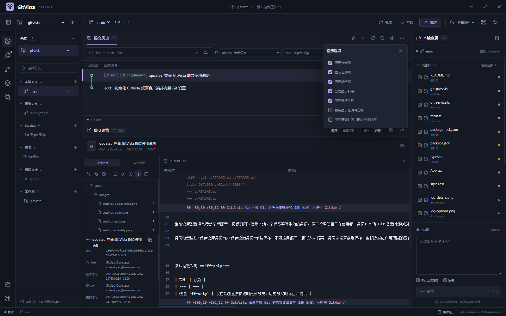

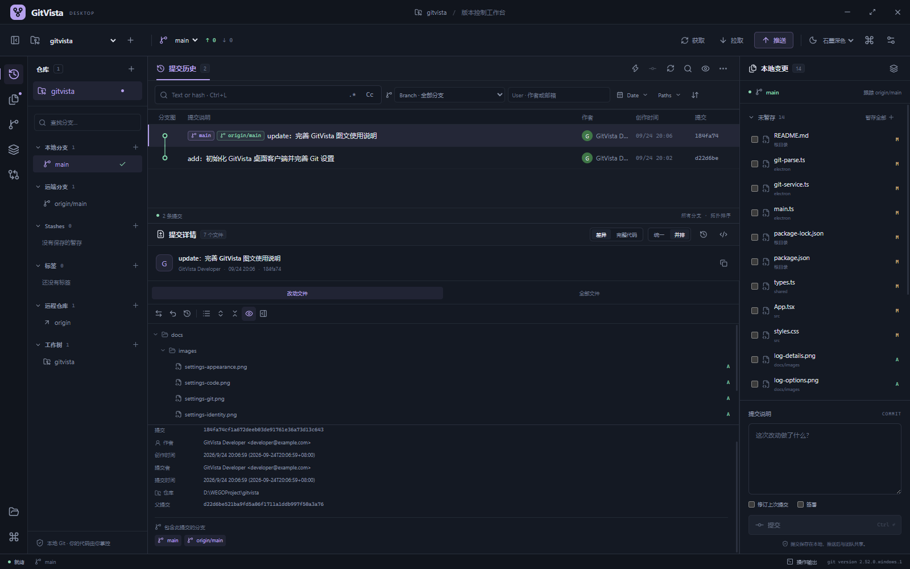

#### 筛选、分页与定位

文本、分支、作者、日期和路径条件可以组合使用。普通文本按字面匹配；正则使用 **Git 扩展正则表达式（ERE）**，例如数字使用 `[0-9]+`。日期条件按**提交者日期**筛选，起止日期都包含当天，日期解释遵循本机时区；日志显示创作时间或提交时间的选项不改变筛选依据。路径是仓库内相对路径，不接受仓库外路径或 `.git` 元数据目录。

日志按页查询，可继续加载更早的提交。查找哈希、分支或标签时直接解析 Git 引用，因此不要求目标提交已经出现在当前列表中；定位不会检出分支，也不会修改工作区。

“定位”会清除当前筛选，并显示目标提交及其之前的历史。文本框中的短哈希搜索仍受已选分支、作者、日期和路径条件约束。作者输入支持姓名或邮箱，也可从当前仓库作者列表选择。

日志显示选项保存在本机，下次启动仍会使用；筛选条件在切换仓库时重置。文件面板固定使用逐级目录树；详情和预览开关用于当前工作台布局。

#### 只撤销某个文件在某次提交中的改动

在提交历史中选择提交，再选择其改动文件，点击“反向撤销所选历史文件改动”，在弹窗中检查引用和文件路径后执行。这会把该文件在该提交中的补丁反向应用到当前工作区；产生的修改保持**未暂存**，需自行检查、暂存和提交。它不是把整个文件直接覆盖成旧版本。

撤销前会显示确认，并检查补丁能否应用。所选文件或重命名前路径有未提交修改时会拒绝操作；仓库正在合并、变基等流程中或存在冲突时也会拒绝。对于合并提交，以第一父提交作为比较基准。若后续修改使反向补丁无法应用，应用会保留现状并提示，不自动覆盖冲突内容。

## 开始使用

### 运行 Windows 便携版

GitVista 的构建目标是 **Windows x64 便携程序**。当前 GitHub 仓库提供源码，尚未上传 EXE 发布附件；按下方步骤本地构建后，双击 `GitVista-<版本号>-Windows-x64.exe` 即可运行，无需安装向导。

**目标电脑不需要预先安装 Git。** 打包时会把 MinGit 一并放进安装包，应用启动后优先使用内置版本，因此在一台全新电脑上装好 GitVista 就能直接打开仓库、提交和推送。

如果本机已经装了 [Git for Windows](https://gitforwindows.org/)，也可以继续使用它：在设置中把“Git 路径”改成 `git.exe` 的完整路径即可，也可以点击“浏览”选择，再用“测试”确认版本。希望沿用系统 `PATH` 里的 Git 时，让自动查找接管即可。

首次进入建议先打开设置确认 Git 路径，再打开仓库并检查提交身份。应用偏好与最近仓库记录保存在当前用户的 Electron 应用数据目录中，便携程序文件与这些配置分开存放。

### 界面语言

默认使用英文。可在 **设置 → 外观与差异 → 界面语言** 切换为中文，保存后立即生效，并记住这次选择。菜单、工具窗口、日志面板、确认对话框与错误信息会一起切换。

### 远端认证

GitVista 沿用本机 Git 的凭据管理器和 SSH 配置，不提供 GitHub / GitLab 账号密码登录界面，也不保存这些平台的密码或访问令牌。

如果克隆、获取或推送提示认证失败，请先确认该远端在本机 Git 中可以正常访问。SSH 密钥、HTTPS 凭据及企业代理等配置仍由 Git 和操作系统管理。

## 设置

点击顶部“应用设置”，或按 `Ctrl + Alt + S` 打开集中设置。设置分为“Git 与提交”和“外观与差异”两类。

### Git 与提交身份


图中的身份与 `developer@example.com` 邮箱仅用于界面演示，不代表当前机器的真实 Git 身份。

| 设置项 | 作用 |
| --- | --- |
| Git 可执行文件 | 默认使用随应用附带的内置 Git；也可以指定本机 `git.exe` 的完整路径，测试功能会检查能否运行并返回版本 |
| 用户名 | 写入 Git 的 `user.name`，作为后续提交的作者姓名 |
| 邮箱 | 写入 Git 的 `user.email`，作为后续提交的作者邮箱 |
| 当前仓库 | 仅影响当前仓库的 Git 配置，适合项目专用身份 |
| 全局 | 影响当前系统用户的 Git 全局配置，可能影响其他 Git 工具和仓库 |
| 默认拉取策略 | 选择快进、合并或变基，决定顶部“拉取”的默认行为 |

内置 Git 与系统 Git 的取舍：把“Git 路径”留作 `git` 时会优先使用内置版本，目标电脑没有安装 Git 也能工作；改成某个 `git.exe` 的绝对路径后，则完全使用那一份 Git，适合需要跟随本机 Git 版本、凭据助手或企业代理配置的场景。

**用户名和邮箱是提交身份，不是 GitHub 登录账号或密码。** 修改它们不会完成远端认证，也不会改写已有提交的作者信息。

当前仓库配置通常覆盖全局配置。设置页同时展示本地、全局及实际生效的身份，便于检查项目正在使用哪个身份；其他 Git 配置来源或环境变量仍可能影响最终结果。保存前请确认作用范围，尤其是会影响其他仓库的全局设置。

身份设置通过“保存仓库身份”或“保存全局身份”单独保存，不随应用偏好一起写入。将某个身份字段清空后保存，会移除对应作用范围的配置；清空仓库身份可以恢复继承全局值。


默认拉取采用 **`ff-only`**：

| 策略 | 行为 |
| --- | --- |
| 快进 `ff-only` | 仅在能够直接快进时更新分支；历史分叉时停止并提示 |
| 合并 `merge` | 拉取后按 Git 合并规则整合远端历史，必要时产生合并提交 |
| 变基 `rebase` | 将本地提交重新应用到拉取后的基础上，会改变这些提交的哈希 |

团队已有 Git 工作流时，请使用与团队约定一致的策略。工具箱中的具体操作仍可提供对应参数。

### 外观与代码阅读


**界面语言**提供英文与中文，默认英文；保存后整个界面（含对话框与错误信息）立即切换。

提供八套主题：**深黑、IDEA 深黑、石墨深色、云白浅色、午夜蓝、北欧极光、森林绿、暮光玫瑰**。其中“深黑”的底色最深（`#0b0c0e`），接近 IDEA 深色编辑器的观感。

外观设置还包括代码字号、自动换行，以及统一 / 并排差异的默认布局。设置保存在本机；切换仓库不会改变项目文件。查看长行时可选择自动换行，也可保留原始行布局并横向滚动。

代码字号支持 **10–22**。修改后点击“保存应用设置”持久保存并立即生效；“恢复默认”先恢复表单中的默认值，确认后仍需保存。


## 选中、暂存与推送

### 勾选只表示选中

“本地变更”面板里的复选框**不再等于暂存**。勾选只是把文件挑出来，不会改动 Git 索引；这样可以把一批改动先选好、逐个查看差异、确认后再统一处理。

| 操作栏按钮 | 作用 |
| --- | --- |
| 暂存选中 | 把当前勾选的未暂存文件加入索引 |
| 取消暂存选中 | 把当前勾选的已暂存文件移出索引 |
| 清除 | 取消所有勾选，不改动任何文件 |

提交时只提交勾选的文件；如果什么都没勾选，则回退为提交整个暂存区——所以「先勾后提交」和「直接提交」都符合直觉。暂存或取消暂存完成后会自动清空勾选，避免文件已经换到另一侧却仍显示为选中。

每个分区标题右侧的“全选”可以一次勾选该分区内的全部文件。面板标题栏的刷新按钮会重新读取工作区状态，显示最新改动；`Ctrl + R` 效果相同。

### 推送前先看将要推送什么

点击顶部“推送”不再直接推送，而是先打开**推送预览**：

- 左侧上方列出**待推送提交**（当前分支领先远端的部分）。
- 左侧下方列出**暂存区文件**；点击任一文件，右侧显示它的暂存版本差异。
- 如果暂存区为空，可以核对完提交列表后直接推送。
- 如果暂存区还有内容，底部按钮会变成“提交并推送”：先提交暂存区，再推送到远端。此时需要先填写提交说明。

推送仍然遵循远端跟踪关系；首次推送会自动建立上游。这一流程与 IDEA 的推送前检查一致，但不会自动改写提交或强制执行其他 Git 操作。

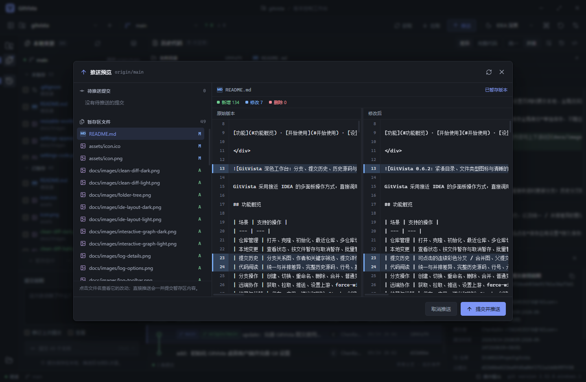

## 快捷键

| 快捷键 | 操作 |
| --- | --- |
| `Ctrl + O` | 打开仓库 |
| `Ctrl + R` | 刷新仓库状态 |
| `Ctrl + L` | 聚焦日志文本 / 哈希搜索 |
| `Ctrl + F` | 定位提交、分支或标签 |
| `Ctrl + D` | 查看所选文件差异 |
| `Ctrl + Enter` | 提交选中的文件（未勾选时提交整个暂存区） |
| `Ctrl + Alt + S` | 打开应用设置 |
| `Esc` | 关闭弹窗或菜单 |

提交、暂存等按钮对应真实 Git 操作。查看提交或浏览源码本身不会切换分支、修改索引或改写文件；勾选文件同样不会改动索引。

## 与 IDEA 的功能对应

GitVista 独立实现 Git 客户端功能，借鉴的是多面板操作方式；当前版本并未覆盖 IDEA 的全部版本控制能力。

| IDEA 中的常见操作 | GitVista 当前能力 |
| --- | --- |
| Git Log、提交详情、文件 Diff | 已支持提交历史、分支图、文件树、统一 / 并排差异 |
| 浏览历史版本 | 已支持完整提交目录树和完整源码 |
| Commit、Amend、Staging | 已支持先勾选再统一暂存或提交；未支持按行或按块暂存 |
| Push 前的提交确认 | 已支持推送预览：列出待推送提交与暂存区文件，可逐个查看差异后再推送 |
| Branches、Merge、Rebase、Cherry-pick | 已支持常规操作；未提供可拖拽的交互式变基编辑器 |
| Resolve Conflicts | 支持 ours / theirs 和手动文本编辑；未提供完整三方合并编辑器 |
| Changelists、Shelf、Local History | 未实现；Git Stash 已支持 |
| Pull Requests / Merge Requests | 未集成托管平台的 PR / MR 工作流 |
| IDE 编辑与语言分析 | 源码浏览提供基础高亮；不包含 IDE 级语言服务、调试或项目构建集成 |
| IDEA 日志索引、多根项目与模块视图 | GitVista 使用 Git 原生查询和可选提交图加速；按仓库切换、按目录分组，不提供 IDEA 的 Search Everywhere、模块模型或多根日志混排 |

其他边界：

- 日志每页默认 **250 条提交**，可继续加载；后端单页最多 **500 条**。文件历史和引用日志仍以最多 **500 条**的单次查询展示。
- 图形设置提供排序和合并过滤；尚未实现 IDEA 的线性分支折叠、长边折叠和所有高亮规则。日志列不包含托管平台 CI 检查，提交详情不验证 GPG 签名。
- 完整历史目录树最多读取 **50,000 个条目**，并受 Git 输出大小限制。
- 文本文件读取上限为 **4 MB**；过大的差异会截断并提示。
- 二进制文件不作为文本编辑；无效 UTF-8 文本会拒绝打开，避免保存时破坏原始编码。这类情况不再以红色错误横幅提示，而是在内容区居中给出说明，并保留「在文件管理器中显示」的入口。
- 并排差异基于 Git 补丁展示；完整源码视图为只读，实际编辑入口位于冲突工具中。
- 内置 Git 为 MinGit 2.47.1，包含日常提交、分支与远端操作所需的命令，但不包含 Git Bash、Perl 扩展和图形工具。
- 当前发布和验证目标为 Windows x64，未提供 macOS 或 Linux 发布包。

## 开发与构建

本项目使用 **Electron + React + TypeScript + Vite**，由 esbuild 构建主进程与预加载脚本，electron-builder 生成 Windows 便携包。开发环境使用 Node.js 24 和 npm。

```powershell
git clone https://github.com/sssjack/gitvista.git
cd gitvista
npm ci
npm run dev
```

开发服务器仅监听本机 `127.0.0.1:5179`，启动脚本会同时打开 Electron。

| 命令 | 用途 |
| --- | --- |
| `npm run dev` | 启动开发环境 |
| `npm run typecheck` | TypeScript 类型检查 |
| `npm run build` | 类型检查并构建前端、主进程和预加载脚本 |
| `npm run start` | 运行已构建的桌面应用 |
| `npm run fetch:mingit` | 下载并解包内置 Git 到 `vendor/mingit`（已存在则跳过） |
| `npm run package:dir` | 生成解包后的 Windows 应用目录 |
| `npm run package` | 构建并生成 Windows x64 便携 EXE |
| `powershell -ExecutionPolicy Bypass -File scripts/install-local.ps1` | 将已构建的解包程序放到版本目录，并创建桌面快速启动快捷方式 |

```powershell
npm run build
npm run start
npm run package
```

### 内置 Git 的获取方式

`npm run package` 与 `npm run package:dir` 会通过 `prepackage` 钩子自动执行 `scripts/fetch-mingit.mjs`：从 git-for-windows 官方发布下载 MinGit 2.47.1，解包到 `vendor/mingit`，再交给 electron-builder 打包进 `resources/git`。已存在且版本一致时会直接跳过，不会重复下载约 45 MB 的压缩包。

```powershell
npm run fetch:mingit            # 缺失时下载
node scripts/fetch-mingit.mjs --force   # 强制重新获取
```

网络受限时可以用 `GITVISTA_MINGIT_URL` 指向本地或镜像中的压缩包：

```powershell
$env:GITVISTA_MINGIT_URL = 'D:\mirror\MinGit-2.47.1-64-bit.zip'
npm run package
```

`vendor/` 已加入 `.gitignore`，内置 Git 不随源码提交，但会随打包产物发布。如果下载失败，打包仍会完成，只是产出的 EXE 不含内置 Git —— 此时未安装 Git 的电脑无法使用，安装过的电脑不受影响。

主要输出目录：

- `dist/`：渲染进程页面与静态资源。
- `dist-electron/`：主进程和预加载脚本。
- `vendor/mingit/`：下载得到的内置 Git（不提交）。
- `release/win-unpacked/`：可直接运行的 Windows 应用目录。
- `release/GitVista-<版本号>-Windows-x64.exe`：便携发布程序。

修改前端代码可使用 Vite 开发更新；修改主进程或预加载脚本后，需要重新构建并重启 Electron。

### 架构

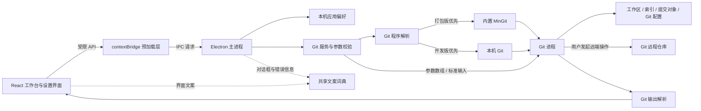

主进程与渲染进程共用 `shared/messages.ts` 中的一份文案词典：界面以中文原文为键，`translate()` 在英文模式下查表替换；主进程内部的错误与校验信息保持中文原文，统一在 IPC 边界翻译，因此服务层与测试都与语言无关。

### 项目目录

```text
gitvista/
├─ assets/                  应用图标
├─ docs/images/             README 界面截图
├─ electron/
│  ├─ main.ts               窗口、IPC、应用设置与权限边界
│  ├─ preload.ts            渲染进程可用的受限 API
│  ├─ git-runtime.ts        内置 / 系统 Git 的解析与运行环境
│  ├─ git-service.ts        Git 查询、操作与参数校验
│  ├─ settings-service.ts   偏好校验与旧配置兼容
│  ├─ renderer-origin.ts    渲染页面来源校验
│  └─ git-parse.ts          状态、提交、分支等输出解析
├─ shared/
│  ├─ types.ts              跨进程数据与 API 类型
│  └─ messages.ts           中英文案词典（主进程与界面共用）
├─ src/
│  ├─ App.tsx               多面板工作台、选中与推送预览
│  ├─ components/
│  │  ├─ LogPanel.tsx       日志筛选、分页、定位与显示选项
│  │  ├─ CommitDetails.tsx  完整提交元数据与包含分支
│  │  ├─ FileTree.tsx       紧凑逐级目录与文件状态
│  │  ├─ FileIcon.tsx       文件类型图标
│  │  ├─ SelectMenu.tsx     可搜索的主题化选择菜单
│  │  ├─ CodeViewer.tsx     完整源码及主题高亮
│  │  ├─ DiffViewer.tsx     并排 / 统一差异
│  │  ├─ ResizeHandle.tsx   面板分隔线的拖动、键盘与重置
│  │  └─ SettingsDialog.tsx 集中设置界面
│  ├─ lib/
│  │  ├─ i18n.tsx           语言上下文与 useI18n
│  │  ├─ syntax.ts          轻量词法高亮与大文件保护
│  │  └─ panel-preferences.ts 面板尺寸的本地偏好
│  ├─ main.tsx              渲染入口与错误边界
│  ├─ styles.css            主题与界面样式
│  └─ workbench-layout.css  工作台布局细节
├─ scripts/
│  ├─ dev.mjs               开发服务器与 Electron 启动
│  ├─ build-electron.mjs    主进程与预加载构建
│  └─ fetch-mingit.mjs      内置 Git 的下载与解包
├─ package.json             依赖、命令与打包配置
└─ vite.config.ts           渲染进程构建配置
```

新增功能时，应保持“界面 → 受限 IPC → 主进程校验 → Git 服务”的调用路径。仓库路径、引用和操作模式必须在主进程侧验证，不能只依赖界面表单校验。

新增界面文案时，把中文原文直接写进组件并调用 `t(...)`，再在 `shared/messages.ts` 的 `EN` 记录里补上英文。漏登记只会让该条目在英文模式下回退为中文，不会显示成键名。

## 验证方式

提交修改前至少执行：

```powershell
npm run typecheck
npm run build
git diff --check
```

本地验证覆盖了真实仓库的状态、历史、差异、完整目录树和源码读取，以及解析器、危险参数拒绝、重命名、未产生首次提交的索引处理和冲突分支。Git 写操作通过进程与文件写入隔离的模拟测试检查参数；界面测试覆盖多面板交互、主题、设置、窄窗口和打包后的应用启动。

日志功能额外验证组合筛选、正则和大小写、分页、窗口外提交定位、截至所选版本的文件历史，以及哈希与路径条件同时生效。单文件撤销通过模拟 Git 进程验证反向补丁预检查、重命名两端保护、冲突 / 未提交内容拒绝及不自动暂存提交；这部分测试不对真实仓库执行撤销。

内置 Git 与语言切换的验证包括：可执行文件解析在打包版优先内置、开发版优先系统 Git，两者都会退回对方；中英文案按界面语言切换，主进程对话框与错误信息随偏好语言变化；偏好校验对未知语言回退英文。

**测试脚本仅保留在本地。** `tests/`、`.local/` 及测试生成文件均由 `.gitignore` 排除，不随仓库提交或发布。因此，公开仓库不提供可直接运行的完整自动化测试套件；上面的类型检查和构建命令可从源码复现。

只读验证会比对测试前后的仓库状态和索引，确保浏览操作没有改变仓库。远端认证、网络环境、用户钩子以及实际推送结果仍取决于使用者的 Git 配置；模拟测试不等同于在所有远端服务上完成真实写入验证。

## 安全与数据

- 渲染进程启用沙箱和上下文隔离，禁用 Node 集成，仅通过预加载层访问必要能力。
- IPC 检查调用页面和已打开仓库；Git 命令通过参数数组执行，不提供任意 Shell 命令入口。
- 文件路径检查限制越界、`.git` 元数据访问和符号链接写入；文件、差异和进程输出均设有大小限制。
- 同一仓库的 Git 写操作串行处理；只读查询关闭 Git 的可选索引刷新锁。
- 丢弃、重置、删除、变基、强制推送等操作会显示对应确认；强制推送使用 `--force-with-lease`。
- 远端 URL 展示会隐藏凭据；Git 身份配置与平台密码分离，应用不提供密码或令牌存储功能。

GitVista 调用的是本机 Git 或随应用附带的内置 Git（打包版默认后者）。提交钩子、凭据助手和 SSH 等机制仍遵循所选 Git 的配置；应用的渲染沙箱不代表 Git 子进程运行在隔离容器中。

## 许可证

项目当前在 `package.json` 中标记为 **`UNLICENSED`**，尚未授予 MIT、Apache 或其他开源许可证。仓库公开可见不等于获得任意使用、修改或再分发许可；相关授权需与维护者确认。第三方依赖遵循各自的许可证。
