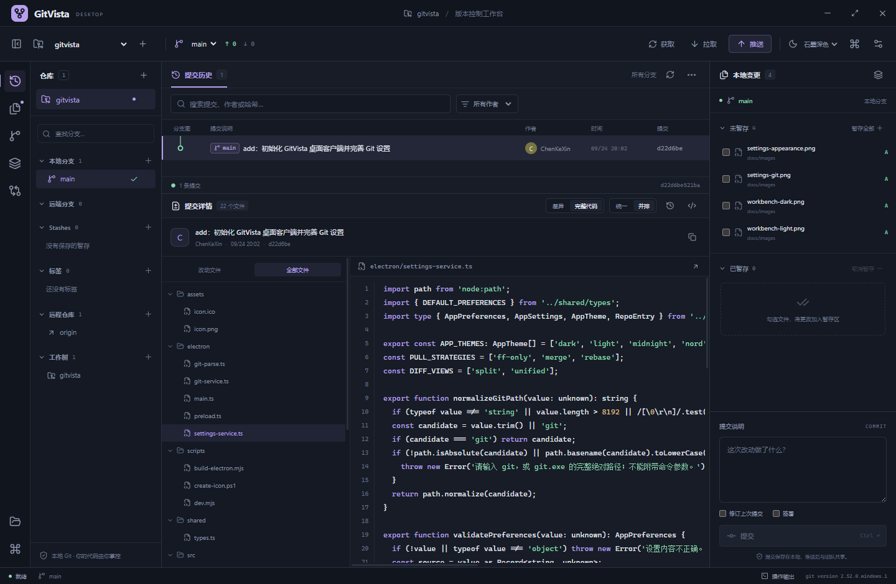
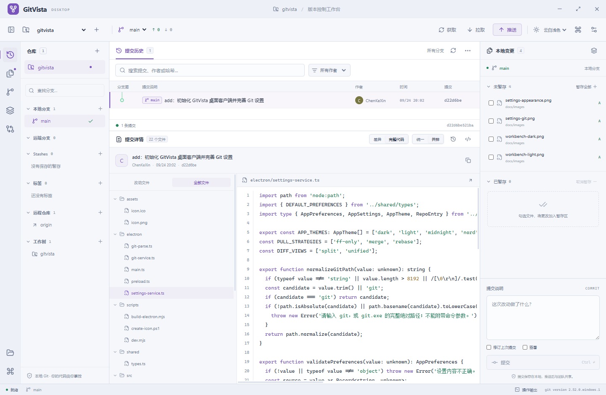
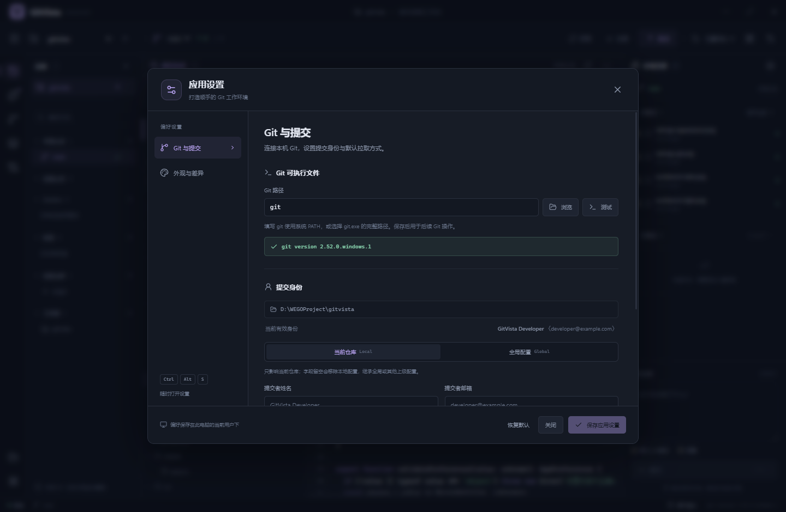
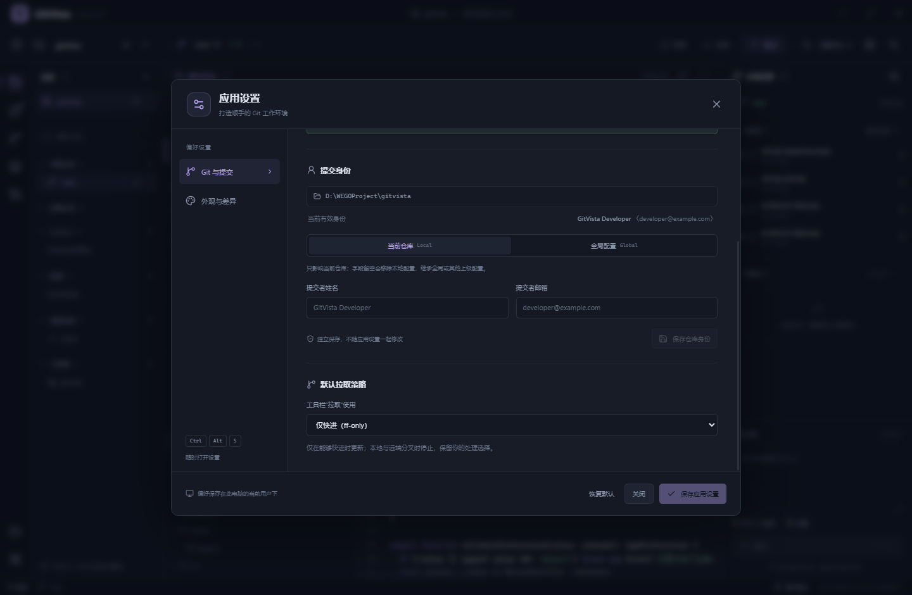
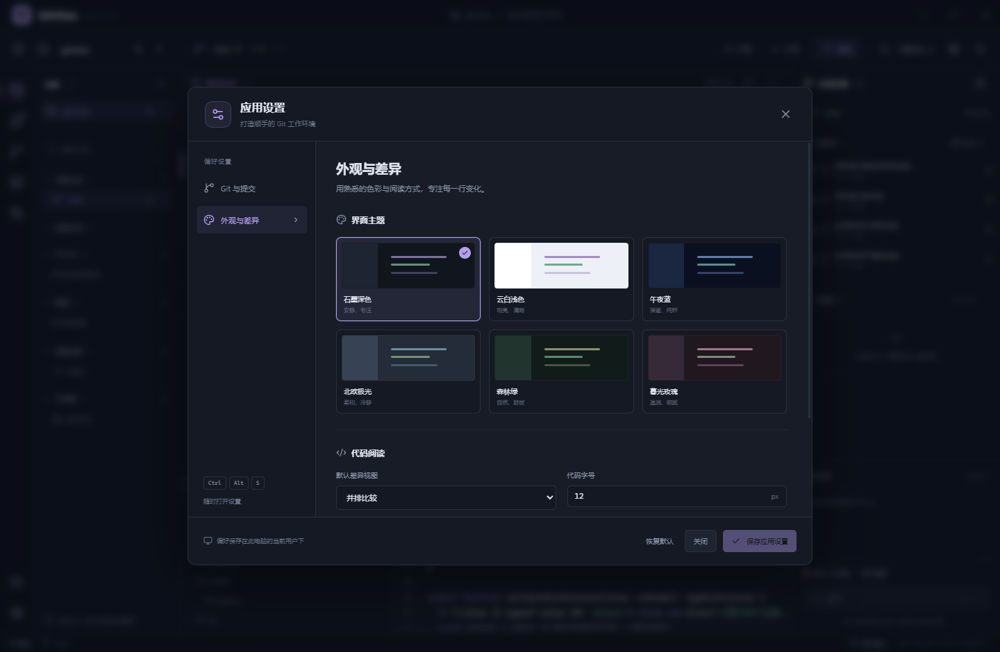
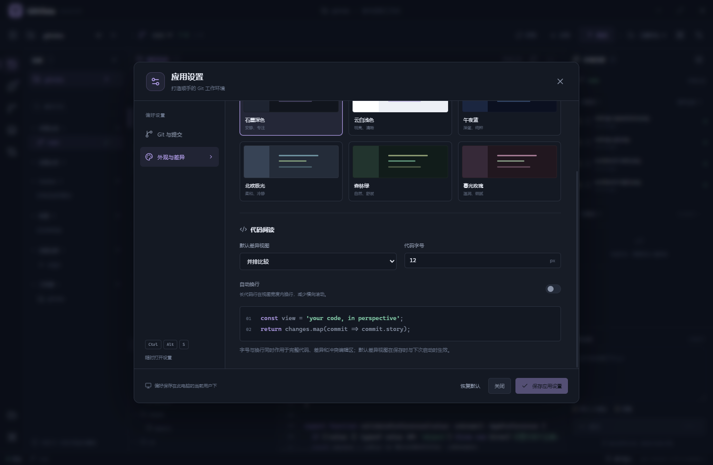
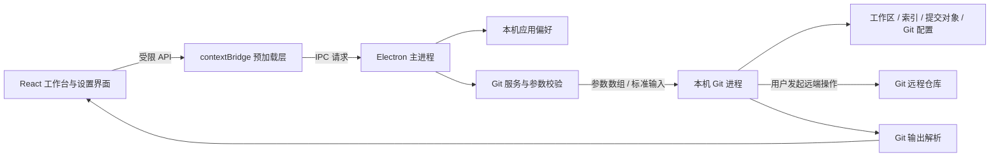

<div align="center">

# GitVista

**看清每一次变更。**

面向 Windows 的中文 Git 桌面客户端，把仓库、分支、提交历史、完整源码和代码差异放进同一个工作台。

[功能](#功能概览) · [开始使用](#开始使用) · [设置](#设置) · [开发](#开发与构建) · [能力边界](#与-idea-的功能对应)

</div>



GitVista 采用接近 IDEA 的多面板操作方式，直接调用本机 Git，读取真实的工作区、索引和提交对象。既可以处理日常提交与分支操作，也可以在某次历史提交的完整目录中浏览源码。无需数据库或独立后端服务。

## 功能概览

| 场景 | 支持的操作 |
| --- | --- |
| 仓库管理 | 打开、克隆、初始化、最近仓库、多仓库切换、工作树切换 |
| 本地变更 | 查看状态、按文件暂存与取消暂存、批量暂存、提交、修订上一条提交、Signed-off-by、忽略规则、丢弃已跟踪文件的修改 |
| 提交历史 | 分支关系图、作者和关键字筛选、提交详情、改动文件树、完整历史目录树、文件历史、逐行追溯、引用日志 |
| 代码阅读 | 统一与并排差异、完整历史源码、行号、基础语法高亮、字号和自动换行 |
| 分支操作 | 创建、切换、重命名、删除、合并、普通变基、拣选、反向提交、soft / mixed / hard 重置 |
| 远端协作 | 获取、拉取、推送、设置上游、force-with-lease、标签推送、远端地址管理 |
| 储藏与标签 | 保存、应用、弹出和删除 Stash；创建轻量或附注标签、删除本地标签 |
| 冲突处理 | 标记冲突、选择 ours / theirs、编辑冲突文件、保存并标记解决、继续 / 中止 / 跳过操作 |
| 进阶工具 | 比较引用、导出和应用补丁、工作树管理、查看及递归更新子模块 |
| 应用设置 | Git 可执行文件、提交身份、默认拉取策略、主题、差异视图、代码字号、自动换行 |



### 一个工作台完成日常操作

1. **打开仓库**：选择已有 Git 仓库，或通过克隆、初始化创建工作区。
2. **检查修改**：右侧区分未暂存和已暂存文件；点击文件检查差异，勾选后加入暂存区。
3. **提交代码**：填写提交说明，按需选择修订上一条提交或添加 Signed-off-by。
4. **浏览历史**：点击提交，下方切换“改动文件”或“全部文件”，再选择“差异”或“完整代码”。
5. **同步远端**：通过顶部获取、拉取、推送按钮操作；更多功能集中在 Git 工具箱中。

侧栏、历史面板、文件目录与本地变更面板支持拖动分隔线调整空间。完整代码视图读取所选提交的内容；对删除文件，可查看父提交中的版本。

## 开始使用

### 运行 Windows 便携版

GitVista 的构建目标是 **Windows x64 便携程序**。当前 GitHub 仓库提供源码，尚未上传 EXE 发布附件；按下方步骤本地构建后，双击 `GitVista-<版本号>-Windows-x64.exe` 即可运行，无需安装向导。

使用前需安装 [Git for Windows](https://gitforwindows.org/)。默认从 `PATH` 查找 `git`；如未找到，可在设置中指定 Git 可执行文件，并运行连接测试。

首次进入建议先打开设置确认 Git 路径，再打开仓库并检查提交身份。应用偏好与最近仓库记录保存在当前用户的 Electron 应用数据目录中，便携程序文件与这些配置分开存放。

### 远端认证

GitVista 沿用本机 Git 的凭据管理器和 SSH 配置，不提供 GitHub / GitLab 账号密码登录界面，也不保存这些平台的密码或访问令牌。

如果克隆、获取或推送提示认证失败，请先确认该远端在本机 Git 中可以正常访问。SSH 密钥、HTTPS 凭据及企业代理等配置仍由 Git 和操作系统管理。

## 设置

点击顶部“应用设置”，或按 `Ctrl + Alt + S` 打开集中设置。设置分为“Git 与提交”和“外观与差异”两类。

### Git 与提交身份



图中的身份与 `developer@example.com` 邮箱仅用于界面演示，不代表当前机器的真实 Git 身份。

| 设置项 | 作用 |
| --- | --- |
| Git 可执行文件 | 使用系统 `git`，或指定 `git.exe` 的完整路径；测试功能会检查能否运行并返回版本 |
| 用户名 | 写入 Git 的 `user.name`，作为后续提交的作者姓名 |
| 邮箱 | 写入 Git 的 `user.email`，作为后续提交的作者邮箱 |
| 当前仓库 | 仅影响当前仓库的 Git 配置，适合项目专用身份 |
| 全局 | 影响当前系统用户的 Git 全局配置，可能影响其他 Git 工具和仓库 |
| 默认拉取策略 | 选择快进、合并或变基，决定顶部“拉取”的默认行为 |

**用户名和邮箱是提交身份，不是 GitHub 登录账号或密码。** 修改它们不会完成远端认证，也不会改写已有提交的作者信息。

当前仓库配置通常覆盖全局配置。设置页同时展示本地、全局及实际生效的身份，便于检查项目正在使用哪个身份；其他 Git 配置来源或环境变量仍可能影响最终结果。保存前请确认作用范围，尤其是会影响其他仓库的全局设置。

身份设置通过“保存仓库身份”或“保存全局身份”单独保存，不随应用偏好一起写入。将某个身份字段清空后保存，会移除对应作用范围的配置；清空仓库身份可以恢复继承全局值。



默认拉取采用 **`ff-only`**：

| 策略 | 行为 |
| --- | --- |
| 快进 `ff-only` | 仅在能够直接快进时更新分支；历史分叉时停止并提示 |
| 合并 `merge` | 拉取后按 Git 合并规则整合远端历史，必要时产生合并提交 |
| 变基 `rebase` | 将本地提交重新应用到拉取后的基础上，会改变这些提交的哈希 |

团队已有 Git 工作流时，请使用与团队约定一致的策略。工具箱中的具体操作仍可提供对应参数。

### 外观与代码阅读



提供六套主题：**石墨深色、云白浅色、午夜蓝、北欧极光、森林绿、暮光玫瑰**。

外观设置还包括代码字号、自动换行，以及统一 / 并排差异的默认布局。设置保存在本机；切换仓库不会改变项目文件。查看长行时可选择自动换行，也可保留原始行布局并横向滚动。

代码字号支持 **10–22**。修改后点击“保存应用设置”持久保存并立即生效；“恢复默认”先恢复表单中的默认值，确认后仍需保存。



## 快捷键

| 快捷键 | 操作 |
| --- | --- |
| `Ctrl + O` | 打开仓库 |
| `Ctrl + R` | 刷新仓库状态 |
| `Ctrl + Enter` | 提交当前已暂存的更改，仍需满足提交条件 |
| `Ctrl + Alt + S` | 打开应用设置 |
| `Esc` | 关闭弹窗或菜单 |

提交、暂存等按钮对应真实 Git 操作。查看提交或浏览源码本身不会切换分支、修改索引或改写文件。

## 与 IDEA 的功能对应

GitVista 独立实现 Git 客户端功能，借鉴的是多面板操作方式；当前版本并未覆盖 IDEA 的全部版本控制能力。

| IDEA 中的常见操作 | GitVista 当前能力 |
| --- | --- |
| Git Log、提交详情、文件 Diff | 已支持提交历史、分支图、文件树、统一 / 并排差异 |
| 浏览历史版本 | 已支持完整提交目录树和完整源码 |
| Commit、Amend、Staging | 已支持按文件暂存、提交及修订；未支持按行或按块暂存 |
| Branches、Merge、Rebase、Cherry-pick | 已支持常规操作；未提供可拖拽的交互式变基编辑器 |
| Resolve Conflicts | 支持 ours / theirs 和手动文本编辑；未提供完整三方合并编辑器 |
| Changelists、Shelf、Local History | 未实现；Git Stash 已支持 |
| Pull Requests / Merge Requests | 未集成托管平台的 PR / MR 工作流 |
| IDE 编辑与语言分析 | 源码浏览提供基础高亮；不包含 IDE 级语言服务、调试或项目构建集成 |

其他边界：

- 历史记录分批加载，当前查询上限为 **500 条提交**。
- 完整历史目录树最多读取 **50,000 个条目**，并受 Git 输出大小限制。
- 文本文件读取上限为 **4 MB**；过大的差异会截断并提示。
- 二进制文件不作为文本编辑；无效 UTF-8 文本会拒绝打开，避免保存时破坏原始编码。
- 并排差异基于 Git 补丁展示；完整源码视图为只读，实际编辑入口位于冲突工具中。
- 当前发布和验证目标为 Windows x64，未提供 macOS 或 Linux 发布包。

## 开发与构建

本项目使用 **Electron + React + TypeScript + Vite**，由 esbuild 构建主进程与预加载脚本，electron-builder 生成 Windows 便携包。开发环境使用 Node.js 24 和 npm。

```powershell
git clone https://github.com/sssjack/gitvista.git
cd gitvista
npm ci
npm run dev
```

开发服务器仅监听本机 `127.0.0.1:5179`，启动脚本会同时打开 Electron。

| 命令 | 用途 |
| --- | --- |
| `npm run dev` | 启动开发环境 |
| `npm run typecheck` | TypeScript 类型检查 |
| `npm run build` | 类型检查并构建前端、主进程和预加载脚本 |
| `npm run start` | 运行已构建的桌面应用 |
| `npm run package:dir` | 生成解包后的 Windows 应用目录 |
| `npm run package` | 构建并生成 Windows x64 便携 EXE |

```powershell
npm run build
npm run start
npm run package
```

主要输出目录：

- `dist/`：渲染进程页面与静态资源。
- `dist-electron/`：主进程和预加载脚本。
- `release/win-unpacked/`：可直接运行的 Windows 应用目录。
- `release/GitVista-<版本号>-Windows-x64.exe`：便携发布程序。

修改前端代码可使用 Vite 开发更新；修改主进程或预加载脚本后，需要重新构建并重启 Electron。

### 架构



### 项目目录

```text
gitvista/
├─ assets/                  应用图标
├─ docs/images/             README 界面截图
├─ electron/
│  ├─ main.ts               窗口、IPC、应用设置与权限边界
│  ├─ preload.ts            渲染进程可用的受限 API
│  ├─ git-service.ts        Git 查询、操作与参数校验
│  ├─ settings-service.ts   偏好校验与旧配置兼容
│  └─ git-parse.ts          状态、提交、分支等输出解析
├─ shared/types.ts          跨进程数据与 API 类型
├─ src/
│  ├─ App.tsx               多面板工作台
│  ├─ components/
│  │  └─ SettingsDialog.tsx 集中设置界面
│  ├─ main.tsx              渲染入口与错误边界
│  └─ styles.css            主题与界面样式
├─ scripts/                 开发与 Electron 构建脚本
├─ package.json             依赖、命令与打包配置
└─ vite.config.ts           渲染进程构建配置
```

新增功能时，应保持“界面 → 受限 IPC → 主进程校验 → Git 服务”的调用路径。仓库路径、引用和操作模式必须在主进程侧验证，不能只依赖界面表单校验。

## 验证方式

提交修改前至少执行：

```powershell
npm run typecheck
npm run build
git diff --check
```

本地验证覆盖了真实仓库的状态、历史、差异、完整目录树和源码读取，以及解析器、危险参数拒绝、重命名、未产生首次提交的索引处理和冲突分支。Git 写操作通过进程与文件写入隔离的模拟测试检查参数；界面测试覆盖多面板交互、主题、设置、窄窗口和打包后的应用启动。

**测试脚本仅保留在本地。** `tests/`、`.local/` 及测试生成文件均由 `.gitignore` 排除，不随仓库提交或发布。因此，公开仓库不提供可直接运行的完整自动化测试套件；上面的类型检查和构建命令可从源码复现。

只读验证会比对测试前后的仓库状态和索引，确保浏览操作没有改变仓库。远端认证、网络环境、用户钩子以及实际推送结果仍取决于使用者的 Git 配置；模拟测试不等同于在所有远端服务上完成真实写入验证。

## 安全与数据

- 渲染进程启用沙箱和上下文隔离，禁用 Node 集成，仅通过预加载层访问必要能力。
- IPC 检查调用页面和已打开仓库；Git 命令通过参数数组执行，不提供任意 Shell 命令入口。
- 文件路径检查限制越界、`.git` 元数据访问和符号链接写入；文件、差异和进程输出均设有大小限制。
- 同一仓库的 Git 写操作串行处理；只读查询关闭 Git 的可选索引刷新锁。
- 丢弃、重置、删除、变基、强制推送等操作会显示对应确认；强制推送使用 `--force-with-lease`。
- 远端 URL 展示会隐藏凭据；Git 身份配置与平台密码分离，应用不提供密码或令牌存储功能。

GitVista 调用的是本机 Git。提交钩子、凭据助手和 SSH 等机制仍遵循本机配置；应用的渲染沙箱不代表 Git 子进程运行在隔离容器中。

## 许可证

项目当前在 `package.json` 中标记为 **`UNLICENSED`**，尚未授予 MIT、Apache 或其他开源许可证。仓库公开可见不等于获得任意使用、修改或再分发许可；相关授权需与维护者确认。第三方依赖遵循各自的许可证。
