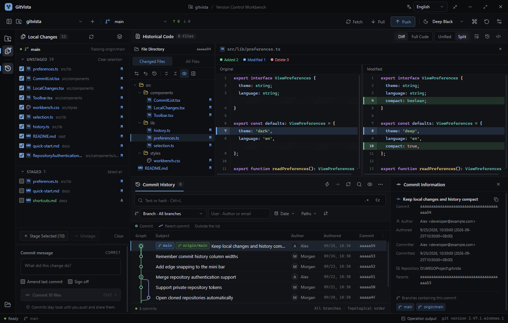

<div align="center">

# GitVista

**看清每一次变更，再放心按下提交。**

一个面向 Windows 和 macOS 的 Git 桌面工作台。看修改、查历史、管多个仓库，忙的时候还能缩成桌面上的一小条。

**Windows 内置 Git · 多仓库工作区 · 先预览再推送 · 迷你快捷提交 · 中文 / English · 12 套主题**

[🌐 官网](https://sssjack.github.io/gitvista/) · [⬇️ 下载安装包](https://github.com/sssjack/gitvista/releases/latest) · [为什么用它](#为什么用它) · [开始使用](#开始使用) · [能力边界](#能力边界)

[](https://github.com/sssjack/gitvista/releases/latest)
[](LICENSE)
[](#能力边界)

</div>



*工作台示例图。截图使用演示数据；实际界面随版本持续改进。*

---

## 30 秒说清楚

**它解决什么？** 你可能也遇到过：改了几个项目，终端开了八个，最后不记得自己到底推了哪一个。GitVista 专门收拾这类"小事很多、切来切去"的日常。

**装起来麻烦吗？** Windows 包内置 Git；Mac 版使用已安装的命令行工具或 Homebrew Git。两者都不需要 Node.js 或注册账号。

**要钱吗？** 不要。MIT 开源，想怎么用怎么用。

**那它有什么不一样？** 三件事，别的客户端要么没做，要么做得不够好：

| 你可能受过的苦 | GitVista 怎么做 |
| --- | --- |
| 好几个项目来回切窗口看 git 状态 | **打开父文件夹，子仓库全认出来。** 状态和历史放一屏，批量拉取，每个仓库单独报结果 |
| 手快点了推送，事后才发现推错东西 | **推送前先给你一份清单。** 待推送的提交、暂存内容、目标远端都列出来；看完了内容又变了，会请你再看一遍 |
| 只想提交一下，却要开一个大窗口 | **桌面边上一小条就够了。** 迷你横条支持快捷提交、拉取、推送预览，不用时磁吸收起，不占地方 |

## 和常见 Git 客户端比一比

下表按各产品公开资料整理，只对比公开、可验证的能力。GitVista 的位置很明确：**把本地 Git 操作做到顺手，不碰托管平台集成。**

| 能力 | **GitVista** | GitHub Desktop | Sourcetree | GitKraken | Fork | TortoiseGit |
| --- | --- | --- | --- | --- | --- | --- |
| 价格 / 授权 | ✅ **免费 · MIT 开源** | 免费 | 免费 | 免费版 + 付费档 | 付费，有试用 | 免费开源 |
| 内置 Git，免装免配 | ✅ **Windows 内置 MinGit 2.47.1；macOS 使用本机 Git** | 内置但隐藏 | 常需手动指向外部 Git | 倾向用系统 Git | 用系统 Git | 需自行装 Git for Windows |
| 多仓库统一工作区 | ✅ **打开父目录自动发现，按仓库报结果** | ✗ | ✗ | ◐ 部分 | ✗ | ✗ |
| 推送前逐项预览 | ✅ **列提交 + 暂存内容，内容变了要重确认** | ◐ | ✗ | ◐ | ◐ | ✗ |
| 桌面迷你快捷入口 | ✅ **快捷提交 / 拉取 / 推送预览，可磁吸收起** | ✗ | ✗ | ✗ | ✗ | ✗ |
| 免注册、免登录 | ✅ **无需账号，打开即用** | 需 GitHub 账号 | ✅ | 需账号 | ✅ | ✅ |
| 界面语言 / 主题 | ✅ **中 / English；12 套主题；4 档字号** | 跟随系统 | 跟随系统 | 多主题 | 多主题 | 跟随系统 |
| 大仓库分页与内存预算 | ✅ **分页 + 可见区渲染 + 取消过期读取** | ◐ | ◐ | ◐ | ◐ | ✗ |
| 公开资源占用实测报告 | ✅ **含测试机配置、场景、采样方法与局限性** | ✗ | ✗ | ✗ | ✗ | ✗ |
| 代码审查 / PR / Issue 集成 | ✗ 专注本地 Git | ✅ | ◐ | ✅ | ◐ | ✗ |
| Linux / macOS | ◐ macOS 支持 Apple Silicon / Intel；暂无 Linux | ✅ | ✅ | ✅ | ✅ | ✗ |

✅ 支持 · ◐ 部分支持或需额外条件 · ✗ 不支持

> 竞品信息来自各自公开文档，能力与价格随时可能变化，请以官方说明为准。

## 为什么用它

- **多个仓库，打开一个父文件夹就行。** 自动发现子仓库，统一看状态和历史；可以批量拉取、预览后推送，每个仓库都有自己的结果。谁成功、谁卡住，不用靠回忆。
- **这次到底提交什么，先看清楚。** 工作区和暂存区分开展示，文件可勾选、差异可逐个查看。推送前核对提交、文件和目标；预览之后内容变了，会请你重新确认，避免"看的是 A，交上去的是 B"。
- **查历史不必在几个窗口里来回跳。** 提交图、文件树、改动内容、完整历史源码联动显示。想查某个文件怎么变成今天这样，直接沿着历史往回看。
- **主窗口大，桌面入口小。** 迷你横条支持拉取、查看最近提交、快捷提交和推送预览；贴到屏幕边缘还能收起来。它负责待命，不负责占据你的整张桌面。
- **不用先给 Git 配一套入场仪式。** Windows 包自带 MinGit，打开本地仓库就能用；需要特殊配置时，也能指定本机完整 Git。
- **眼睛和使用习惯都值得照顾。** 5 套浅色、7 套深色主题；中英文切换，四档界面字号，独立代码字号，自动换行和统一 / 并排差异。面板、历史列宽可以自己拖。
- **资源占用有边界，也有账可查。** 历史按页读取，日志与图只绘制可见部分；大文件按页解析；过期查询取消，托盘暂停自动刷新。设置里能看内存、缓存并清理可重建内容。缓存可以长大，不能没人管。

它直接调用 Git，不需要你再启动数据库或部署独立后端。代码阅读和仓库分析在本地完成；拉取、推送仍通过你配置的远端与认证方式。

## 下载安装

**最新版本：[GitVista 0.9.8](https://github.com/sssjack/gitvista/releases/latest)**

| 下载 | 大小 | 适合谁 |
| --- | ---: | --- |
| [**安装版** `GitVista-0.9.8-Setup-x64.exe`](https://github.com/sssjack/gitvista/releases/download/v0.9.8/GitVista-0.9.8-Setup-x64.exe) | 121 MiB | **推荐。** 有安装向导，可选安装目录，自动建桌面快捷方式 |
| [**便携版** `GitVista-0.9.8-Windows-x64.exe`](https://github.com/sssjack/gitvista/releases/download/v0.9.8/GitVista-0.9.8-Windows-x64.exe) | 121 MiB | 放 U 盘带走，或不想动注册表 |
| [**Mac · Apple Silicon** `GitVista-0.9.8-macOS-arm64.dmg`](https://github.com/sssjack/gitvista/releases/download/v0.9.8/GitVista-0.9.8-macOS-arm64.dmg) | 122.07 MiB | M 系列芯片，macOS 13 或更新版本 |
| [**Mac · Intel** `GitVista-0.9.8-macOS-x64.dmg`](https://github.com/sssjack/gitvista/releases/download/v0.9.8/GitVista-0.9.8-macOS-x64.dmg) | 127.31 MiB | Intel 芯片，macOS 13 或更新版本 |

[查看全部版本](https://github.com/sssjack/gitvista/releases) · [官网](https://sssjack.github.io/gitvista/)

> 两个 Windows 包都内置 Git，**装完就能用，不需要先装 Git for Windows。**
>
> 便携包启动时要解压一次，日常频繁使用更推荐安装版——便携不是"零磁盘占用"的魔法，它只是少了一步安装。

### 想先看看长什么样

[官网](https://sssjack.github.io/gitvista/) 有完整的功能说明、实测报告和使用教程，右上角还能切换明亮 / 深色主题。

## 开始使用

### 路线一：直接下载（推荐）

**Windows：** 从上面的 [下载安装](#下载安装) 拿到安装器，双击，选好目录，下一步到底。默认建议装到 `D:\LenovoSoftstore\GitVista`，装完桌面会有 **GitVista** 快捷方式。

**macOS：** 在「关于本机」查看芯片，选择 Apple Silicon（M 系列）或 Intel 包。打开 DMG，将 **GitVista.app** 拖入 **Applications / 应用程序**，再从应用程序启动。Release 同时提供 ZIP 包。

Mac 版需要 Git：先在终端运行 `git --version`。尚未安装时运行 `xcode-select --install` 并完成系统安装，或使用已有的 Homebrew 执行 `brew install git`。应用会查找系统 Git、`/opt/homebrew/bin/git` 和 `/usr/local/bin/git`，也可在设置里指定路径。

首次打开若提示开发者无法验证，请确认安装包来自本仓库，在「系统设置 → 隐私与安全性」选择「仍要打开」。本版只有 ad-hoc 签名，未经过 Apple 公证；参见 [Apple 打开应用说明](https://support.apple.com/zh-cn/102445)。

### 路线二：从源码自己打包

在 Windows、Node.js 22 或更新版本的兼容环境中：

```powershell
git clone https://github.com/sssjack/gitvista.git
cd gitvista
npm ci
npm run package
```

成功后 `release/` 包含安装器、便携包和可直接运行的 `win-unpacked/`。

只需要本机安装，可走更短的路径：

```powershell
npm run package:dir
npm run install:local
```

本地安装脚本默认使用 `D:\LenovoSoftstore\GitVista\<版本号>`。先复制到临时安装目录并校验，再更新正式目录和固定桌面入口；安装成功后清理安全可删除的旧版。旧版仍在运行或目录中有用户额外文件时，会保留并记录原因。

**同一台机器请选一种安装方式持续更新。** 安装器和本地安装脚本服务于不同使用场景，不建议交替覆盖同一个目录。打开新版前，先从托盘退出旧版，避免单实例机制又把旧窗口带回来。

Mac 构建需要 macOS 13+、Node.js 22.12+ 和命令行工具：

```sh
npm ci
npm run package:mac              # Apple Silicon + Intel，DMG 和 ZIP
npm run package:mac -- --arm64   # 只构建 Apple Silicon；Intel 用 --x64
```

成功产物位于 `release/macos-<版本>-<构建标识>/`，不同构建分别保留。GitHub Actions 的 [macOS packages](https://github.com/sssjack/gitvista/actions/workflows/macos.yml) 会在两种芯片的原生 macOS 环境中构建并验证启动。Windows 的安装和清理脚本仅用于 Windows。

## 日常怎么用

### 1. 打开仓库，或者一整个工作区

- 打开有 `.git` 的目录，进入单仓库工作台。
- 打开装着多个项目的父目录，进入多仓库工作区。
- 也可以指定父目录克隆远端仓库，完成后自动打开。
- 最近打开的位置保存在本机，最多 30 条。

多仓库批量操作按仓库报告成功、失败和跳过。它们不是一个跨仓库事务：某个仓库失败，不会撤回其他仓库已经完成的提交或推送。

### 2. 看修改，再提交

左边选择文件，右边看差异。**Diff / Full Code** 切换差异和完整源码，**Unified / Split** 切换统一和并排视图。

勾选文件只是选择，并不等于已经暂存。你可以批量暂存、取消暂存、提交或修订上一次提交。迷你横条的 **Quick commit / 快捷提交** 会显示文件与来源，填写说明后创建本地提交；**本地提交成功，不等于已经推送到远端。**

推送预览会列出待推送提交和暂存内容。执行前重新核对 HEAD、分支、远端及索引；内容变化就先刷新预览。未暂存的后续改动不会悄悄混进已审阅的暂存提交。

### 3. 查历史，不把整个仓库塞进内存

历史支持文本、哈希、正则、分支、作者、日期和路径筛选。筛选查询作用于 Git 历史，不局限于当前页。

- 提交历史每页最多 250 条，文件历史每页最多 100 条，支持前后翻页。
- 提交图和列表只绘制可见部分；多仓库历史使用有限预读与游标归并。
- 大文件和大 Diff 按最多 400 行或约 128 KiB 文本窗口分页，保留完整内容的翻页入口。
- 分页边界处的语法颜色可能简化；大 Diff 的颜色统计以当前页为准，原始增删和行号仍保留。

拖动面板和列的分隔线即可调整空间。点击图上的节点或连线可定位相关提交；断开的父节点表示它位于当前结果之外，不代表提交丢了。

### 4. 获取、拉取、推送，三个动作各有分工

| 动作 | 通俗解释 |
| --- | --- |
| Fetch / 获取 | 先看看远端有什么新东西，更新远端引用 |
| Pull / 拉取 | 把远端变化整合到当前分支；默认仅快进，分叉时停下来 |
| Commit / 提交 | 给本地修改留一个可追溯的版本 |
| Push / 推送 | 把本地提交送到配置好的远端 |

工具箱还提供分支、标签、Stash、合并、普通变基、拣选、反向提交、重置、工作树、补丁和子模块操作。破坏性动作有确认，强制推送使用 `--force-with-lease`。

冲突可以选 ours / theirs，也可以手动编辑后标记解决，再继续当前 Git 操作。Git 的复杂情况不会因为换成按钮就自动消失，但至少可以把当前状态摆在眼前。

### 5. 需要时展开，忙起来收好

- 标题栏 **—**：最小化到 Windows 任务栏或 macOS Dock。
- 标题栏 **×**：默认询问退出或隐藏到系统托盘（macOS 为菜单栏），可记住选择。
- **设置 → 常规**：以后想改关闭行为，随时回来改。
- **Mini bar / 迷你横条**：第一次使用时才创建，悬停展开，靠近屏幕边缘可磁吸收起。
- **只留托盘时**：暂停自动历史刷新；恢复窗口时重新读取。单仓库工作台长时间隐藏后，会释放已读取的历史、差异和源码数据，保留筛选位置和提交草稿。


Git 写操作或设置保存未结束时，会阻止直接退出，避免手快关掉正在干活的程序。

## 体积与内存：把数字摆出来

**源码大小、开发目录大小、安装大小，是三本不同的账。** `node_modules`、历史安装包和测试浏览器目录不能全部算成"软件运行必需体积"。

本机 0.9.8 实测：源码与文档约 **4.85 MiB**，安装器 **121.09 MiB**，解压程序 **478.93 MiB**。前台主窗口私有内存均值约 **276 MiB**，托盘场景约 **205 MiB**。这是本机短时样本，仓库大小和使用方式都会影响结果。

完整的新旧版本对比与统计口径见 [资源占用实测报告](docs/resource-report-0.9.8.md)。报告列出测试机器、场景、采样方法与限制；不拿刚启动的一瞬间冒充全天平均值。

GitVista 基于 Electron，带有浏览器运行时。它免部署、少配置，但不是几 MB 的原生小工具。我们更愿意把实际数字摆出来，而不是给"轻量"两个字装上美颜。

**设置 → 常规 → 存储与性能** 可查看当前应用进程内存与缓存。HTTP 缓存预算为 32 MiB；可重建缓存合计超过 128 MiB 会安排下次启动维护。手动清理先处理 HTTP 与代码缓存，GPU 等原生缓存留到下次启动安全处理。仓库、提交草稿、设置不会因此被删除。

### 越用越大，哪些会自动处理？

| 内容 | 处理方式 |
| --- | --- |
| 临时 Git 索引和预览对象 | 独立事务目录，正常结束回收；有所有权标记的安全遗留可恢复处理 |
| 读取任务 | 合并相同查询，取消过期读取；全局进程、单仓库读取和输出缓冲均有预算 |
| 历史与源码显示 | 有限分页、可见区域渲染、当前页解析，不无限追加界面内容 |
| 旧安装和打包产物 | 校验成功后按归属清单清理；运行中的旧版和额外用户文件保留 |
| 本地验证产物 | 统一标记目录，按保留规则、年龄和预算维护 |
| 用户仓库的 `.git` 历史 | 属于用户数据，不为"瘦身"激进删除 |
| npm / Electron / Playwright 全局缓存 | 属于构建机器共享缓存，不由应用启动时擅自清空 |

旧版留下且无法确认归属的目录、可能用于恢复提交的索引会保守保留。自动清理的目标是收拾自己产生的垃圾，不是替你决定哪些文件"看起来没用"。

## 开发

```powershell
git clone https://github.com/sssjack/gitvista.git
cd gitvista
npm ci
npm run dev
```

开发服务只监听 `127.0.0.1:5179`。修改主进程或预加载脚本后，需要重新构建并重启。

| 命令 | 用途 |
| --- | --- |
| `npm run dev` | 启动开发环境 |
| `npm run typecheck` | 检查 TypeScript 类型 |
| `npm run build` | 构建前端和 Electron 主进程 |
| `npm run package:dir` | 生成可直接运行的解压程序 |
| `npm run package` | 在 Windows 生成安装器和便携包；在 Mac 生成双架构 DMG / ZIP |
| `npm run package:mac -- --arm64` | 在 Mac 上生成 Apple Silicon 包（Intel 使用 `--x64`） |
| `npm run install:local` | 安装到本机并更新桌面快捷方式 |
| `npm run clean:artifacts` | 安全清理项目构建及验证产物 |
| `npm run validation:run -- <分组> node <本地脚本>` | 在带归属标记的目录中运行本地验证 |

预览清理计划：

```powershell
npm run clean:artifacts -- -WhatIf
```

安装脚本支持 `-KeepOldVersions` 与 `-SkipArtifactCleanup`；清理脚本支持调整保留数量。测试脚本和测试目录只保留在本地，不提交到 Git。新的验证脚本应将临时仓库、截图和浏览器配置放在 `GITVISTA_VALIDATION_DIR` 下。

Windows 打包会获取并验证 MinGit 2.47.1；macOS 不携带 Windows Git，使用本机 Git。已有可用版本会复用；下载或构建失败不会替换上一份成功产物。发布包只带应用构建结果与运行所需文件，不夹带开发用的整套 `node_modules`。

### 代码在哪里

| 目录 | 职责 |
| --- | --- |
| `electron/` | 窗口、Git 调用、任务调度、事务与缓存维护 |
| `src/` | React 工作台、差异/历史阅读、迷你面板 |
| `shared/` | 类型、设置约定、中英文文案 |
| `scripts/` | 构建、安装、产物清理 |
| `docs/` | 说明、截图和资源实测报告 |

## 能力边界

说得清楚一点，省得你下载完才发现不合适。

- 支持 **Windows x64** 和 **macOS 13+（Apple Silicon / Intel）**；暂无 Linux 发行包。
- macOS 包使用临时签名（ad-hoc），尚未经过 Apple Developer ID 签名及公证；首次打开可能需要在「系统设置 → 隐私与安全性」允许打开。
- 它是 Git 工作台，**不是 IDE**，也不是完整的代码编辑器。
- 完整历史源码主要用于阅读，实际编辑入口集中在冲突处理。
- 单文件文本读取有 4 MiB 限制；大差异会截断并提示，分页并不取消安全上限。
- 不把二进制或无效 UTF-8 文件当普通文本保存。缺失 Git 对象会报告错误，不自动重置用户仓库。
- 内置 MinGit 不含 Git Bash、Perl 扩展等完整环境；特殊钩子或工作流可在设置中指定系统 Git。
- HTTPS Token / 密码只保留于应用本次运行的内存；系统凭据助手、SSH 和 Git 钩子仍遵循本机配置。
- 多仓库批量操作不具备跨仓库回滚；推送失败不会撤销已经完成的本地提交。
- 未经长期耐久测试，不宣称"零内存泄漏"。资源报告给出已测范围。

## 安全与数据

渲染进程使用沙箱和上下文隔离，关闭 Node 集成。主进程验证调用来源、路径和参数；Git 命令用参数数组执行，同仓库写操作串行，查询取消不会随意中止提交或推送。

清理只处理应用可确认归属的文件，保留配置和用户仓库，遇到目录联接、未知附加文件或恢复数据时宁可留下说明。应用内的 Git 子进程和用户钩子并不因此变成隔离容器。

## 参与贡献

用着不顺手、发现 bug、想要什么功能，都欢迎开 [Issue](https://github.com/sssjack/gitvista/issues) 说一声。觉得还行的话，点个 ⭐ 让更多人看到。

## 许可证

本项目采用 **MIT 许可证**，见 [LICENSE](LICENSE)。你可以自由使用、修改、分发，包括商业用途，只需保留版权声明与许可证原文。第三方依赖遵循各自许可证。
